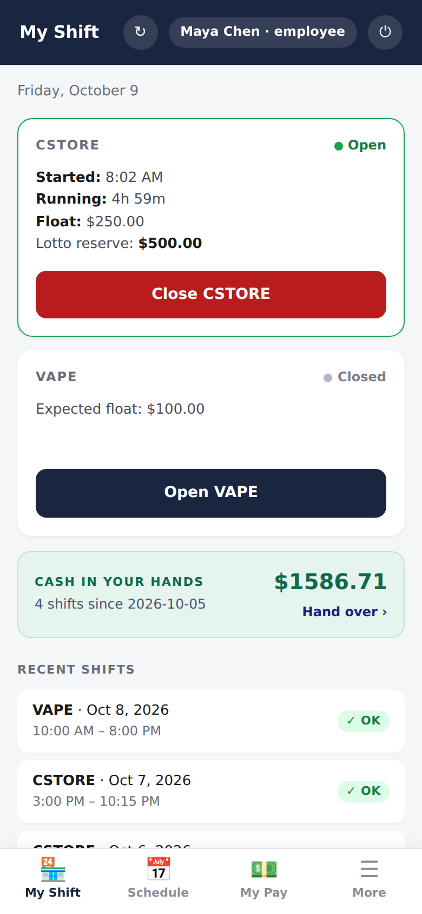
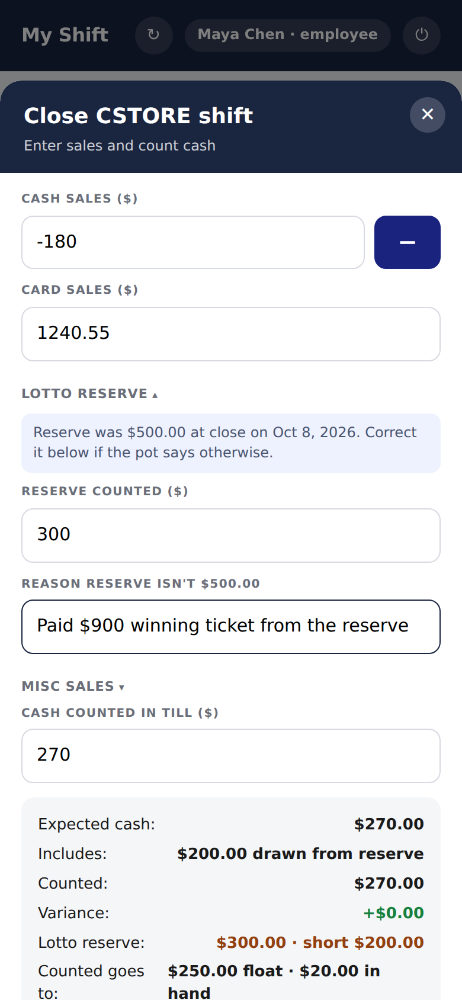
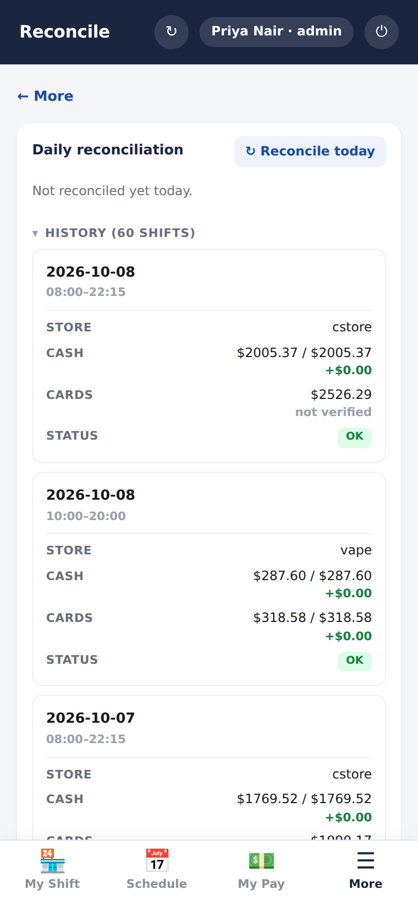
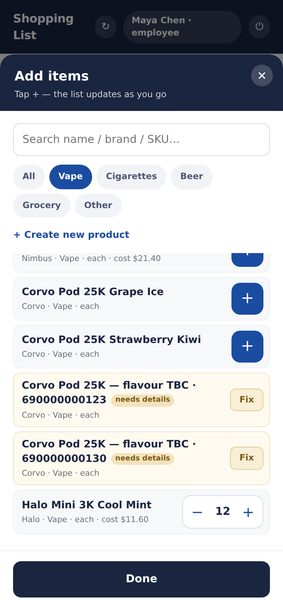
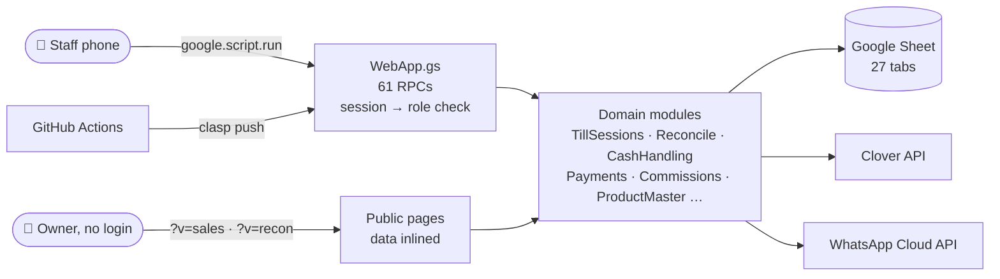

# StoreOps

**Daily operations for a two-till convenience and vape store, on staff
phones.** Open a till, close it in one sheet, reconcile cash and cards against
what measured them, follow every dollar from the drawer to the cash manager,
schedule, pay, compute commissions, and order stock.

It runs on **Google Apps Script with a Google Sheet as the database**, so it
costs nothing to host, has no servers, and keeps the data where the owner can
open it.

| My Shift | Closing a till | Reconcile | Shopping list |
|---|---|---|---|
|  |  |  |  |

<sub>Screenshots are generated from the real code over a fictional store. See
[how](docs/adr/0018-docs-are-generated-from-the-running-code.md).</sub>

## What it does

| | |
|---|---|
| 🏪 **[Shifts and the close](docs/components/shifts-and-close.md)** | Float, tenders, lotto pot, drawer count; expected cash and variance worked out live |
| ⚖️ **[Reconcile](docs/components/reconcile.md)** | Cash against the count, cards against Clover, and "not verified" where nothing measured |
| 💬 **[Notifications](docs/components/notifications.md)** | WhatsApp close message per till, through Meta-approved templates; failures say why |
| 💵 **[Cash handling](docs/components/cash-handling.md)** | Takings tracked per shift until handed over, oldest first, never deleted |
| 📅 **[Schedule and attendance](docs/components/schedule-and-attendance.md)** | Plan the week; hours worked come from the tills |
| 💰 **[Payroll](docs/components/payroll.md)** | Pay oldest days first; each person sees hours × rate for themselves |
| 🎯 **[Commissions](docs/components/commissions.md)** | % over a threshold or a fixed weekly fee, proposed weekly, approved by a person |
| 📊 **[Sales dashboard](docs/components/sales-dashboard.md)** | Trend, weekday, part of month, cash share, with no misleading averages |
| 🔗 **[Public reports](docs/components/public-reports.md)** | Two no-login pages for owners; no API exposed |
| 📦 **[Product master](docs/components/product-master.md)** | Per-type pricing (beer, cigarettes, vape, grocery) and bulk CSV import |
| 🛒 **[Shopping list](docs/components/shopping-list.md)** | One-tap picker by category, sent as one WhatsApp message |
| 🔐 **[App shell and auth](docs/components/app-shell-and-auth.md)** | PIN login, server-side sessions, four roles |

## How it's built



More: [architecture overview](docs/architecture/overview.md) ·
[data model](docs/architecture/data-model.md) ·
[security](docs/architecture/security.md) ·
[deployment](docs/architecture/deployment.md) ·
[decisions](docs/adr/README.md)

## By the numbers

| | |
|---|---|
| Server | 23 Apps Script modules, ~11k lines, 61 RPC endpoints |
| Client | one single-page app + two public pages |
| Tests | 27 suites, 1,000+ assertions over the real source, in CI on every push |
| Docs | 12 component pages, 18 ADRs, generated schema reference and screenshots |

## Quick start

```sh
npm test                     # every suite, no Google account needed
npm run docs:screenshots     # regenerate docs/images from the real app (Playwright)
npm run docs:schema          # regenerate docs/reference/schema.md
```

To deploy your own copy, follow the [setup guide](docs/guides/setup.md).
Pushing a branch updates the test project; merging to `main` deploys
production ([deployment](docs/architecture/deployment.md)).

## Documentation

Start at **[docs/README.md](docs/README.md)** for the overall picture. Presenting the
project? Use the **[ten-minute tour](docs/showcase.md)**.

| | |
|---|---|
| [Context](docs/context.md) | the business, goals, constraints, glossary |
| [Architecture](docs/architecture/overview.md) | system context, layers, module map, the daily flow |
| [Components](docs/components/README.md) | one page per feature, with screenshots |
| [ADRs](docs/adr/README.md) | 18 decisions and the reasoning behind them |
| [Testing](docs/guides/testing.md) | how the suites run the real code |
| [Docs process](docs/guides/docs-process.md) | how the docs stay current, enforced in CI |
| [Changelog](CHANGELOG.md) | every batch, with the reasoning |

## Repository layout

```
src/                 what clasp uploads: *.gs modules, Index.html, public pages
tests/suites/        Node suites over the real source (npm test)
scripts/docs/        screenshot, schema and diagram tooling
docs/                architecture, components, ADRs, guides, generated reference
.github/workflows/   ci.yml (tests), test-deploy.yml (branch), deploy.yml (main)
```
