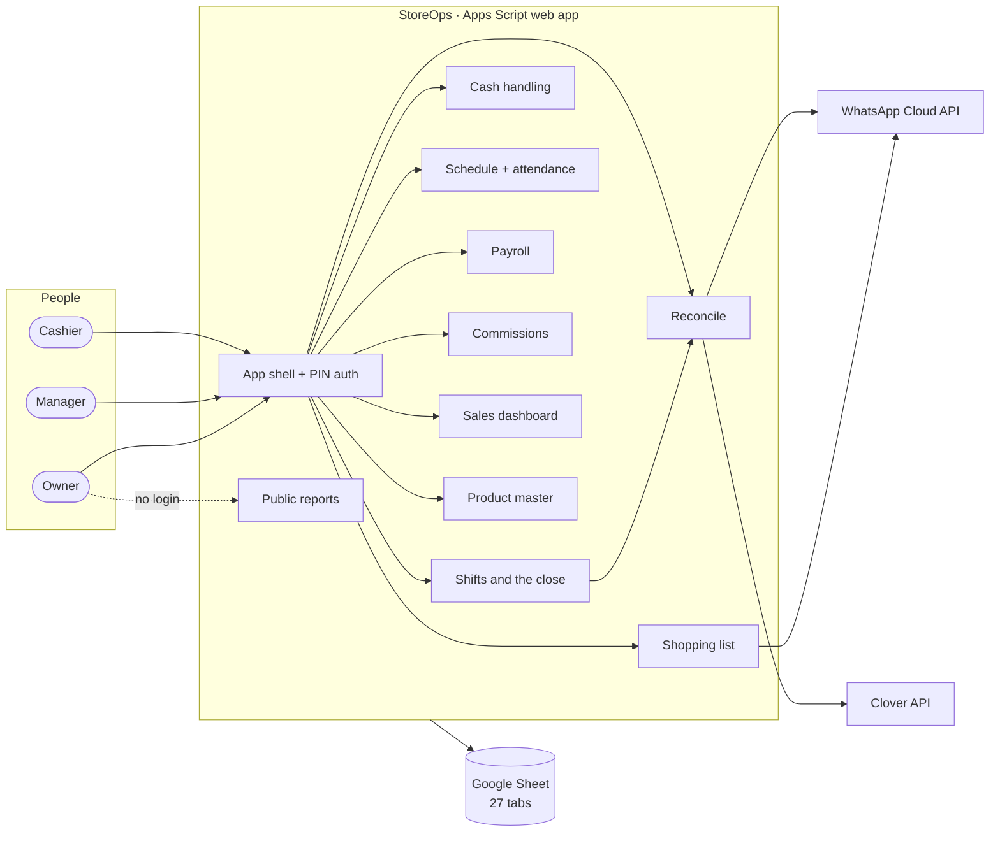

# StoreOps documentation

StoreOps runs the daily operations of a two-till convenience and vape store:
opening and closing tills, reconciling cash and cards, tracking takings until
they reach the cash manager, scheduling, payroll, commissions, the product
catalogue and the shopping list. It runs on a phone, costs nothing to host, and
keeps its data in a Google Sheet the owner can open.

| | | |
|---|---|---|
|  |  |  |
| **Close a till** in one sheet; the app does the arithmetic | **A lotto payout** netted in, balanced to the cent | **Reconcile** cash and cards against what measured them |

## The overall picture



## Start here

| If you want to… | Read |
|---|---|
| understand the business and the problem | [Context](context.md): the store, goals, constraints, glossary |
| see how it's built | [Architecture overview](architecture/overview.md): system context, layers, module map, the daily flow |
| see a feature, with screenshots | [Components](components/README.md): one page per feature |
| know why something is the way it is | [Decisions (ADRs)](adr/README.md): 19 recorded decisions |
| set it up | [Setup guide](guides/setup.md) |
| change it safely | [Testing](guides/testing.md) and [keeping the docs current](guides/docs-process.md) |
| present it | [Showcase](showcase.md): a ten-minute tour for an interview or a management review |
| find a module, RPC or column fast | [Code map](reference/code-map.md) and [schema](reference/schema.md), both generated from the code |
| work on it as an AI agent | [AGENTS.md](../AGENTS.md), then [llms.txt](../llms.txt) for the full index |

## Map of the docs

```
AGENTS.md                     instructions for AI coding agents (CLAUDE.md imports it)
llms.txt                      index of every doc for language models (generated)
docs/
├── README.md                 ← you are here
├── context.md                the business, goals, non-goals, glossary
├── showcase.md               the ten-minute tour
├── architecture/
│   ├── overview.md           system context · containers · module map · daily flow
│   ├── data-model.md         ER diagram · tables by area · conventions
│   ├── security.md           threat model · sessions · roles · public pages
│   └── deployment.md         environments · CI/CD · migrations · config · limits
├── components/               one page per feature, with screenshots
├── adr/                      architecture decision records + template
├── guides/
│   ├── setup.md              zero to a working deployment
│   ├── testing.md            how the suites run the real code
│   ├── docs-process.md       the docs checklist, enforced by CI
│   └── whatsapp-templates.md template bodies to submit to Meta
├── reference/
│   ├── code-map.md           every module, RPC (with roles) and enum (generated)
│   └── schema.md             every tab, column and config key (generated)
├── plans/                    design plans, kept as written
└── images/                   screenshots (generated, fictional data)
```

## About the screenshots

Every image here is produced by `npm run docs:screenshots`, which runs the
real server code in Node over a **fictional** store (120 days of invented
staff, sales and pay) and renders the real pages in Chromium. Nothing comes
from the live store. See
[ADR-0018](adr/0018-docs-are-generated-from-the-running-code.md).
