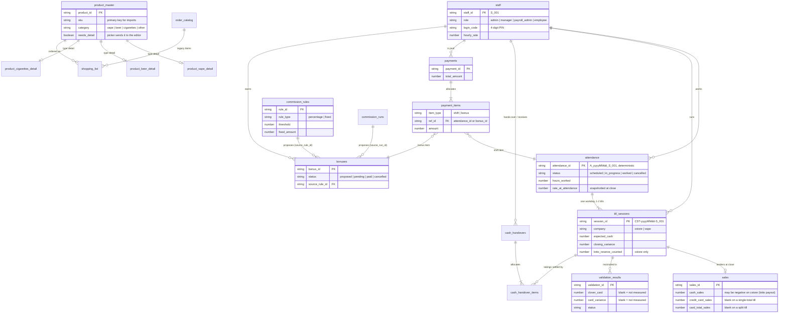

# Data model

All data lives in **one Google Sheet**. Each tab is a table. Row 1 is a title
banner, row 2 is the header, and data starts at row 3. Tables relate through ID
columns; nothing enforces a foreign key except the code that writes them.

The full column list for every tab is **generated from the code** in
[reference/schema.md](../reference/schema.md). This page covers what the tables
mean, how they relate, and the rules that keep them consistent.

## Entity relationships



## The tables, by area

### People and time

| Tab | One row is | Written by |
|---|---|---|
| `staff` | a person, with role, PIN and rate | admin, by hand or in the app |
| `attendance` | one person's workday — **the payroll source of truth** | opening a till, the schedule, admin edits |

A workday is one `attendance` row however many tills the person ran. It opens
when the first till opens (or is created ahead of time by the schedule), and it
completes when the **last** till closes: `actual_end` is set, `hours_worked` is
computed from wall-clock time, and `rate_at_attendance` is **snapshotted**, so a
later raise never re-prices past shifts.

### Tills, sales and cash

| Tab | One row is | Written by |
|---|---|---|
| `till_sessions` | one till (cstore or vape) opened and closed by one person on one day | the shift screen |
| `sales` | the tenders for one till session | the close sheet, with the session |
| `validation_results` | one reconciliation of one shift window | `Reconcile`, after each close or on demand |
| `cash_handovers` | cash moving from a cashier to the cash manager | the cash screen |
| `cash_handover_items` | how much of a handover settles which shift | `CashHandling`, oldest first |

**Expected cash** is computed, never typed:

```
reserve_at_start = previous.lotto_reserve_counted + previous.lotto_topup_from_till
reserve_fed      = reserve_at_start − this.lotto_reserve_counted
expected_cash    = opening_float + cash_sales + misc_cash_sales − cashback_paid + reserve_fed
closing_variance = closing_cash_counted − expected_cash
```

The lotto pot is **counted**, so what it fed the drawer is measured rather than
declared. See [ADR-0008](../adr/0008-lotto-reserve-is-derived-from-two-counts.md).

**Card shapes.** A till either splits credit from debit or reports one card
total (cstore since it moved to ePOS). The two shapes use **different columns
and never share a row**, so

```
card revenue = credit_card_sales + debit_card_sales + card_total_sales
             + misc_credit_sales + misc_debit_sales + misc_card_sales
```

is right on both sides of the change with no date logic. Any analysis must sum
all three card columns. See [ADR-0005](../adr/0005-card-shapes-are-mutually-exclusive-columns.md).

**Cash in hand.** What a cashier is holding is `cash_removed_at_close` for each of
their closed shifts, minus whatever `cash_handover_items` have settled.
Handovers allocate **oldest shift first**, the same walk payroll uses.

### Pay

| Tab | One row is | Written by |
|---|---|---|
| `payments` | money paid to one person on one occasion | payroll screen |
| `payment_items` | how much of a payment went to which shift or bonus | `Payments`, oldest first |
| `bonuses` | a bonus, commission or management fee owed | commission engine (proposed), admin |
| `commission_rules` | a rule: % over a weekly threshold, or a fixed weekly amount | rules screen |
| `commission_runs` | one execution of the weekly engine | engine, Monday trigger or manual |

A shift is paid when its `payment_items` (type `shift`) add up to
`hours_worked × rate_at_attendance`. A bonus moves `proposed → pending → paid`;
the engine only ever **proposes**, so nothing is paid without a person approving
it. See [ADR-0011](../adr/0011-commissions-are-proposed-then-approved.md).

### Stock and ordering

| Tab | One row is | Written by |
|---|---|---|
| `product_master` | a product: name, SKU, price, margin, `needs_detail` | product screen, imports |
| `product_<type>_detail` | the attributes only that type has (vape flavour, beer case price, carton count) | same, keyed by `product_id` |
| `_pm_<type>_staging` | a pasted CSV row waiting to be imported | a person, pasting |
| `shopping_list` | one thing to buy, linked to a product | shopping screen, picker |
| `order_catalog`, `suppliers` | legacy catalogue and supplier reference | by hand |

The core table carries what every product has. The per-type detail tables
carry the rest, so adding a product type adds a table instead of thirty mostly
empty columns. See [ADR-0012](../adr/0012-product-core-plus-per-type-detail.md).

### System

| Tab | One row is |
|---|---|
| `config` | one key and its value; read by every module and cached for 5 minutes |
| `audit_log` | one change: who, what, before, after. Append-only. |
| `pos_extracted`, `clover_batches` | placeholders for a future POS-file and bank-deposit match; nothing writes them |

## Conventions

- **Money** is stored as a number of dollars, rounded to cents by
  `Util.roundMoney` at every write.
- **Dates** are real Date cells, never strings. Business dates are formatted in
  `America/Toronto`.
- **IDs** are prefixed. Some are deterministic so that a retry can't create a
  duplicate: `A_<yyyyMMdd>_<staff>` for attendance, `CST-`/`VAP-<yyyyMMdd>-<staff>`
  for till sessions. The rest are `<PREFIX>_<yyyyMMdd_HHmmss>_<rand>`: `P`, `IT`,
  `B`, `CRN`, `H`, `CI`, `VR`, `PM`, `SL`, `LOG`.
- **Blank is not zero.** A blank cell means *not measured* or *not applicable*,
  and reads back as `null`. Totals may treat it as 0; anything that **shows** a
  figure or compares two must not. See [ADR-0004](../adr/0004-blank-is-not-zero.md).
- **Schema changes append.** A new column goes on the end via a migration in
  `Setup.gs` that is safe to run twice. Existing columns keep their meaning,
  because historic rows still use it.

## A cashier's day, in rows

Maya opens the cstore till at 08:02 and the vape till at 10:00, and closes both
in the evening.

| Moment | Rows |
|---|---|
| Opens cstore | `attendance A_…_S_003` → `in_progress`; `till_sessions CST-…-S_003` → `open` |
| Opens vape | same attendance reused; `till_sessions VAP-…-S_003` → `open` |
| Closes cstore | session → `closed` with variance; `sales` row with one card total; reconcile writes `validation_results` with blank Clover columns |
| Closes vape | session → `closed`; `sales` row with credit + debit; reconcile asks Clover for that window; attendance → `worked`, hours from 08:02 to the last close, rate snapshotted |
| Monday | commission engine proposes `bonuses` from the week's `sales` |
| Hands in cash | `cash_handovers` + one `cash_handover_items` row per settled shift |
| Gets paid | `payments` + `payment_items` against her oldest unpaid `attendance` |
