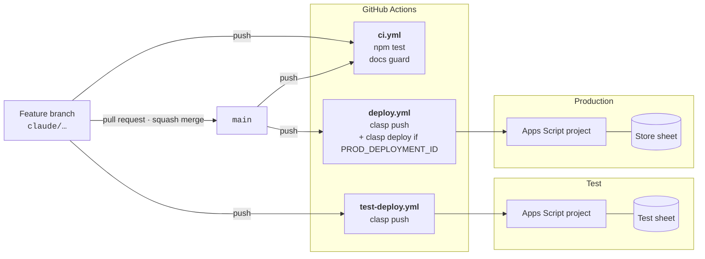
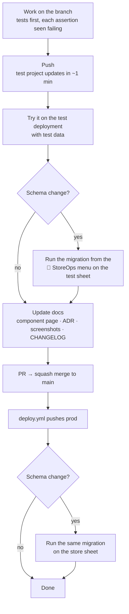

# Deployment and operations

## Environments

Two Apps Script projects, each bound to its own Google Sheet. Code reaches them
only through GitHub Actions. Nobody runs `clasp push` against prod by hand.

| | Test | Production |
|---|---|---|
| Trigger | push to the working branch | push to `main` (a merged PR) |
| Workflow | `.github/workflows/test-deploy.yml` | `.github/workflows/deploy.yml` |
| What it does | `clasp push --force` | `clasp push --force`, then `clasp deploy` to `PROD_DEPLOYMENT_ID` if that repo variable is set |
| Data | a copy for trying changes | the store's real data |

`clasp` uploads `rootDir: src` only. `docs/`, `tests/` and `scripts/` never reach
Apps Script. The script IDs are written inline in each workflow instead of
coming from a secret, so the target of a deploy is visible in review. The only
secret is `CLASPRC_JSON` (the clasp OAuth credentials).

## Continuous integration

`.github/workflows/ci.yml` runs on every push and pull request:

1. `npm test`: every suite in `tests/suites/`, each in its own process. 800+
   assertions over the real `src/` code, with no Google services involved.
2. `npm run docs:check`: the docs guard. The generated schema reference must
   match the code, every component and ADR must be indexed, and every image a
   doc references must exist and be produced by `scripts/docs/screens.js`.

The deploy workflows don't wait for CI. A red CI on `main` means prod is
already running that code, so fix forward fast.

## Releasing a change

## Schema migrations

The schema is code. `firstTimeSetup` builds every tab on an empty sheet, and
each later change ships as a `menu_migrate…` function in `src/Setup.gs`, listed
in the **🏪 StoreOps** menu. Migrations:

- **append** columns and never reuse or reorder existing ones
  ([ADR-0005](../adr/0005-card-shapes-are-mutually-exclusive-columns.md));
- are **safe to run twice**, because each checks before it adds;
- are run **by a person**, once per sheet, after the code that needs them is
  deployed. Code that reads a new column must tolerate its absence until then.

`menu_syncConfigKeys` adds any config keys the code knows about and the sheet
doesn't, with their descriptions, and leaves existing values alone.

The generated [schema reference](../reference/schema.md) is rebuilt by booting
the real `Setup.gs` and running every migration, so it always shows the
**fully migrated** shape.

## Configuration

All runtime configuration is the `config` tab: one key per row, cached for five
minutes. The full list of keys and what each controls is in the
[schema reference](../reference/schema.md#config). The ones that change
behaviour most:

| Key | Effect |
|---|---|
| `<company>_card_split` | `true`: the till reports credit and debit. `false`: one card total (ePOS). |
| `clover_enabled`, `clover_<company>_*` | Which tills have their cards checked against Clover |
| `notifier_enabled`, `whatsapp_*` | Whether messages go out, to whom, through which approved template |
| `cash_manager_staff_id` | Who receives cash handovers. Blank turns cash handling off. |
| `public_report_url` | The link the close message carries to the 7-day report |
| `session_hours`, `login_max_fails`, `login_lockout_mins` | Session length and lockout |

## Scheduled work

| What | When | How it's installed |
|---|---|---|
| Weekly commission run | Mondays at `commission_run_hour` (default 9) for the week just ended | Menu: **Install Weekly Auto-Trigger**. It is never installed automatically. |
| Daily reconcile | after each close (`auto`) and on demand (`manual`) | No trigger. The close itself starts it. |

## Operational limits

Apps Script caps a single execution at 6 minutes. The constraints that shaped
the code:

- **Imports** of a few hundred products used to time out. They now read each
  sheet once and write each sheet once (one `setValues` per table), so cost no
  longer grows with row count ([ADR-0010](../adr/0010-bulk-import-reads-once-writes-once.md)).
- **Read paths** cache per execution: `Sales`, `TillSessions` and
  `CashHandling` each read their sheet once per request. The `perf` and
  `import-perf` suites check that sheet reads stay constant as data grows,
  without depending on wall-clock time.
- **No locking yet.** Nothing takes `LockService`. Payments and handovers
  allocate against a balance they've just read, so two people paying the same
  person in the same second could both allocate the same shift. The store has
  one person doing payroll, so this hasn't happened, but it is a known gap. The
  fix is a script lock around the read-allocate-write in `Payments` and
  `CashHandling`.

## Troubleshooting

| Symptom | Likely cause |
|---|---|
| Login dropdown is empty | No `active = TRUE` rows in `staff` |
| Endless return to login | Session property deleted or expired. Log out, then log in. |
| Close message never arrives | Template not approved, or parameter count mismatch. The reconcile toast and `audit_log` now say which. |
| "Clover unavailable" on vape | Network, auth or 5xx from Clover. Not shown for a till with no Clover configured. |
| Import says a column is missing | The staging header is from an older layout. Run **Refresh staging headers**. |
| Public page shows "unavailable" cards | A section's sheet hasn't been migrated yet. The rest of the page still renders. |
