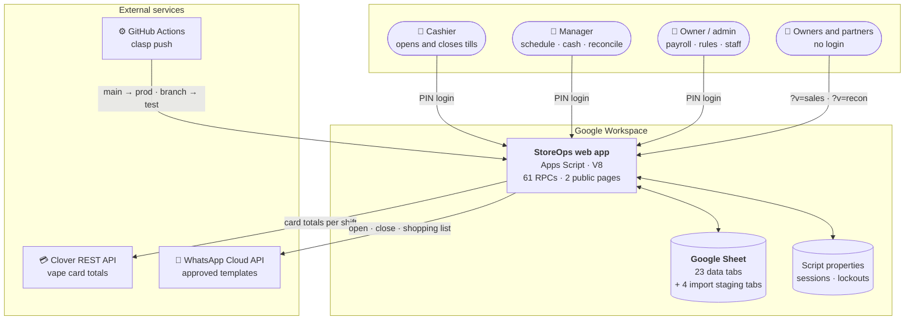
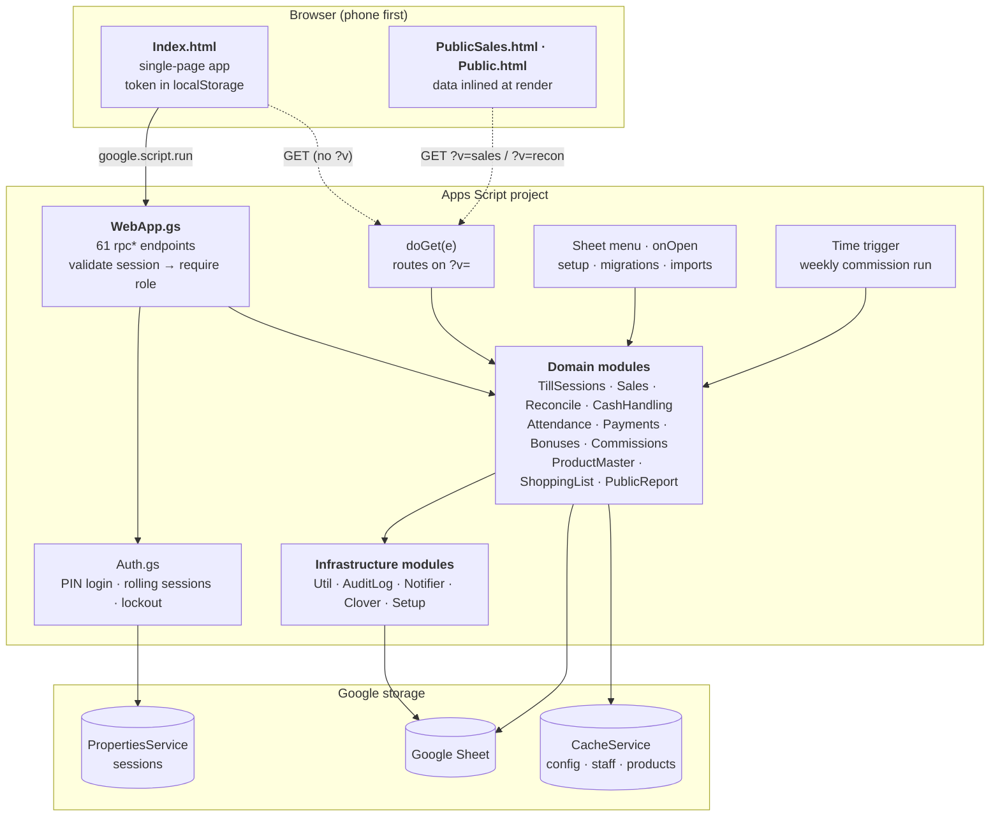
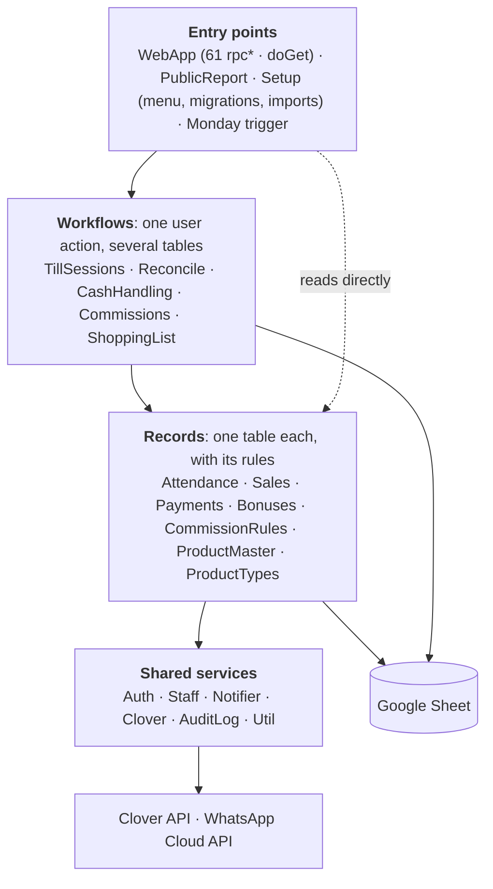
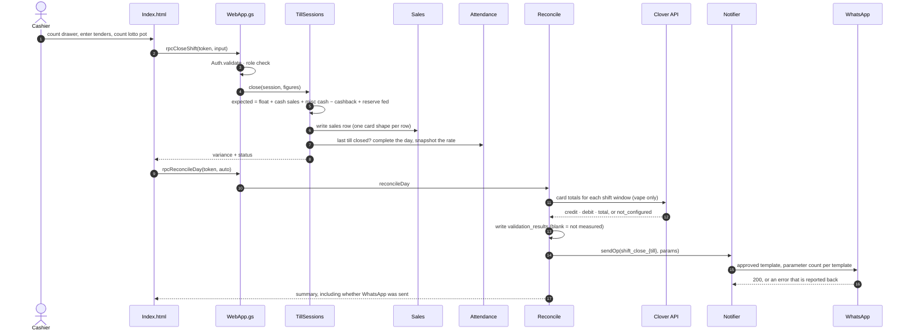

# Architecture overview

StoreOps is a **serverless web app on Google Apps Script** that uses a **Google
Sheet as its database**. A cashier opens it on a phone, signs in with a PIN, and
runs the till; managers and the owner use the same app for schedules, cash,
reconciliation, payroll and commissions. Two pages are public (no login) and
show aggregates only.

| | |
|---|---|
| Runtime | Apps Script, V8, time zone `America/Toronto` |
| Storage | One Google Sheet: 23 data tabs + 4 import staging tabs ([schema](../reference/schema.md)) |
| Server code | 23 `.gs` modules, ~11k lines |
| Client | 3 HTML files: the app (`Index.html`, single page) and two public pages |
| API surface | 61 `rpc*` functions called through `google.script.run` |
| Integrations | Clover REST (card totals), WhatsApp Cloud API (templated messages) |
| Delivery | GitHub Actions → `clasp push` (branch → test project, `main` → prod) |
| Tests | 23 suites, 800+ assertions, run in Node against the real source |

## System context

Who uses it, and what it talks to.

## Containers and layers

Every request takes the same path: the browser calls an `rpc*` function, the
RPC checks the session and role, a domain module does the work, and the module
reads or writes the sheet. The UI holds no business logic it can't redraw from
the server's answer.

Three ways in, one way down:

- **The app** (`doGet` with no `?v`) serves `Index.html`. Everything after that
  is `google.script.run` → `rpc*`.
- **The public pages** (`?v=sales`, `?v=recon`) are rendered on the server with
  their data **inlined into the HTML**. They expose no RPC, so there is nothing
  callable without a session. See [ADR-0003](../adr/0003-public-pages-inline-their-data.md).
- **The spreadsheet menu** runs setup, schema migrations and product imports
  as the sheet owner. Imports live here rather than in the app because they run
  over hundreds of rows. See [ADR-0010](../adr/0010-bulk-import-reads-once-writes-once.md).

## Module map

Modules sit in four layers, and calls go down. The table below gives each
module's direct dependencies, computed from the source; the few calls that go
sideways or up are named under it.

| Module | Depends on (besides `Util` and `AuditLog`) |
|---|---|
| `TillSessions` | Attendance, Sales, Staff, Notifier |
| `Reconcile` | TillSessions, Sales, CashHandling, Clover, Staff, Notifier |
| `CashHandling` | TillSessions, Staff |
| `Commissions` | Sales, CommissionRules, Bonuses, Staff, Notifier |
| `ShoppingList` | ProductMaster, Staff, Notifier |
| `Attendance` | Payments (is a day paid?), Staff, TillSessions |
| `Payments` | Attendance, Bonuses, Staff, Notifier |
| `Bonuses` | Payments (paid amounts), Staff |
| `ProductMaster` ⇄ `ProductTypes` | each other (registry and machinery), Setup (sheet names) |
| `PublicReport` | Sales, Reconcile, CashHandling, TillSessions |
| `Auth` | Staff |

The exceptions: `Attendance` and `Bonuses` ask `Payments` how much of a day
or bonus is already paid, and `Attendance` reads the day's `TillSessions` when it
completes a workday. Apps Script resolves globals at call time, so
these cycles are safe, but they're the places to be careful when changing
either side.

Every module is an IIFE that returns a small public object (`const Sales = (()
=> { ... return { getDashboard, write, ... }; })();`). Private helpers end in
`_`. Apps Script loads all files into one global scope, so this is what keeps a
file's internals private.

## The daily flow, end to end

What happens when a cashier closes the last till of the day. This is the path
that matters most: it produces the numbers the owner reads every evening.

## Cross-cutting rules

These hold across every module. Each has an ADR with the reasoning.

| Rule | Where it bites | ADR |
|---|---|---|
| **Blank is not zero.** A cell nobody measured reads back as `null`, never `0`. | Card columns, Clover figures, public report | [0004](../adr/0004-blank-is-not-zero.md) |
| **Add columns, never repurpose them.** A schema change is a migration that appends. | `sales` card shapes, `needs_detail`, `fixed_amount` | [0005](../adr/0005-card-shapes-are-mutually-exclusive-columns.md) |
| **The server decides.** Roles come from the session, never from the client. | Every `rpc*` | [0002](../adr/0002-pin-login-with-server-side-sessions.md) |
| **Read once, write once.** No sheet call inside a per-row loop. | Imports, dashboards, commission runs | [0010](../adr/0010-bulk-import-reads-once-writes-once.md) |
| **Fail loudly, degrade gracefully.** An integration failure is reported, never swallowed, and never blocks a close. | Clover, WhatsApp | [0007](../adr/0007-message-shape-follows-the-template.md) |
| **Every change is audited.** Money, roles and rules write to an append-only `audit_log`. | Payments, handovers, rules, logins | [0014](../adr/0014-append-only-audit-log.md) |

## Where to read next

- [Data model](data-model.md): the tables, how they relate, and the invariants
- [Security](security.md): login, sessions, roles, the public pages
- [Deployment](deployment.md): environments, CI, configuration, migrations
- [Components](../components/README.md): one page per feature, with screenshots
