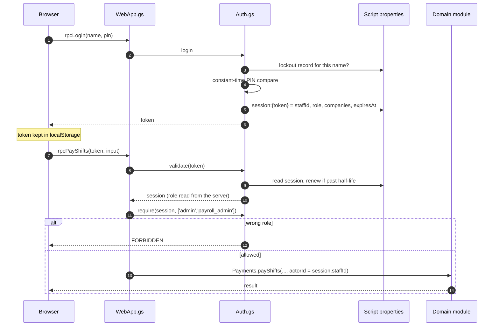

# Security

StoreOps protects pay, cash and sales figures from people who shouldn't see
them, and records who changed what. It is a staff tool for one small business,
so the design is sized to that and doesn't claim more.

## Threat model

| Protects against | Does not protect against |
|---|---|
| Staff seeing each other's pay | Someone with edit access to the Google Sheet |
| A cashier recording a payment or handover as someone else | Staff who share their PIN |
| Opportunistic PIN guessing | A determined attacker who controls the deploying Google account |
| Anonymous readers of the public pages seeing per-person or per-shift detail | |
| Script injection through text staff type into the public pages | |

The Sheet itself is the trust boundary. Anyone who can edit it can change any
number, which is why every write through the app also goes to an append-only
`audit_log` ([ADR-0014](../adr/0014-append-only-audit-log.md)).

## How a request is authorised

- **Login** is a name and a 4-digit PIN, compared in constant time
  (`Staff.verifyLoginCode`). Unknown names and wrong PINs return the same
  message.
- **Lockout:** `login_max_fails` failures (default 5) within
  `login_lockout_mins` (default 60) lock that name for the rest of the window.
  A successful login clears the counter.
- **Sessions** are random 32-hex tokens, stored server-side in script
  properties as `session:<token>`. The client only ever holds the opaque token.
- **Rolling expiry:** `session_hours` (default 24). Any RPC made after the
  session's half-life renews it, so someone who uses the app daily is never
  logged out mid-shift, and an idle device expires within a day.
- **Token storage** is `localStorage`, not `sessionStorage`. Mobile browsers
  discard tabs aggressively, so `sessionStorage` had staff re-entering their
  PIN all day. Logout deletes both the server session and the device copy.
- **The role always comes from the server session**, never from anything the
  client sends. The actor recorded on every write is `session.staffId`.

## Roles

Four roles. The bottom bar (My Shift, Schedule, My Pay, More) is the same for
everyone; the **More** drawer and the RPCs behind it are filtered by role.

| Capability | employee | manager | payroll_admin | admin |
|---|:-:|:-:|:-:|:-:|
| Open and close own tills; see own pay and own cash | ✓ | ✓ | ✓ | ✓ |
| Shopping list, products (create and edit), suppliers | ✓ | ✓ | ✓ | ✓ |
| Schedule shifts, cancel them, adjust hours | | ✓ | | ✓ |
| Deactivate or reactivate a product; clear or generate the list | | ✓ | ✓¹ | ✓ |
| Sales dashboard, reconcile, view commission runs and rules | | ✓ | ✓ | ✓ |
| Run the commission engine; approve or cancel proposed bonuses | | | ✓ | ✓ |
| Pay shifts and bonuses, undo a payment; create and edit rules | | | ✓ | ✓ |
| Edit actual clock times, add an ad-hoc bonus, staff list, import from staging | | | | ✓ |
| Record a cash handover on someone else's behalf | | | | ✓ |

¹ Clearing and generating the shopping list only; product activation is
manager and admin.

The table is read from the `Auth.require` call at the top of each `rpc*` in
`WebApp.gs`, which is what actually enforces it. The drawer just hides what
a role can't use.

Cashiers add most new products, so product create and edit are open to every
role on purpose. What's new or changed is visible in `audit_log`.

## The public pages

`?v=sales` and `?v=recon` need no login. They are for owners and partners who
shouldn't need a PIN to see how trade is going.

- **No callable surface.** The server builds the page with its data inlined,
  so nothing reachable without a session is an RPC. Changing a URL parameter
  can't fetch anything else ([ADR-0003](../adr/0003-public-pages-inline-their-data.md)).
- **Aggregates only on the sales page.** The payload is built by
  `PublicReport.buildSales`, which emits totals and per-day sums. The
  `public-report` suite asserts that no staff name, staff ID, session ID or
  sales ID appears anywhere in it.
- **The 7-day report names people on purpose.** It shows who is holding how
  much cash and the lotto pot's daily notes, because owners chasing cash need
  exactly that. It shows no pay, rates or PINs.
- **Inlined text is escaped for the HTML parser.** The page needs the
  unescaping scriptlet (`<?!= ?>`) so that the JSON arrives as an object, which
  means the parser sees it raw. `inlineJson_` writes `<` as `<`, so a note
  containing `</script>` stays text (`public-inline` suite).
- **Inputs are clamped.** `?days=` is coerced and then clamped (1–31 and
  1–365). A failed build serves an "unavailable" card, never a stack trace.

## Deployment settings that matter

From `src/appsscript.json`:

| Setting | Value | Why |
|---|---|---|
| `executeAs` | `USER_DEPLOYING` | The script reads the Sheet as its owner. Staff never need Sheet access. |
| `access` | `ANYONE_ANONYMOUS` | The public pages need it. The app itself is gated by the PIN login. |
| Scopes | spreadsheets, container UI, script triggers, external requests, user email | External requests are Clover and WhatsApp only. |

## Secrets

Clover tokens and the WhatsApp token live in the `config` tab, readable by
anyone with Sheet access, which is the same group that can already change any
figure. They are never sent to the client: no RPC returns `config` rows, and the
bootstrap RPC returns only the caller's identity and shift state. The generated [schema reference](../reference/schema.md) lists
config **keys** and never values. Deploy credentials (`CLASPRC_JSON`) are a
GitHub Actions secret.

## Audit

Logins (`login.success`, `login.fail` with a reason, `login.logout`), payments,
undo, handovers and voids, rule changes, product changes and every notification
write a row to `audit_log` with actor, target, before and after. Nothing in
the app updates or deletes `audit_log` rows.
