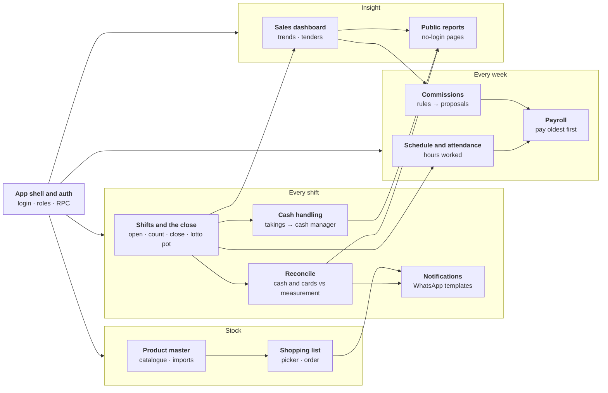

# Components

One page per feature. Each covers what it does for the person using it (with
screenshots of the real app), how it works, the data it owns, the rules it must
never break, and the tests that hold those rules down.

| Component | Who uses it | Server modules | Page |
|---|---|---|---|
| App shell and auth | everyone | `WebApp`, `Auth`, `Staff`, `Index.html` | [app-shell-and-auth.md](app-shell-and-auth.md) |
| Shifts and the close | cashiers | `TillSessions`, `Sales`, `Attendance` | [shifts-and-close.md](shifts-and-close.md) |
| Reconcile | managers, owner | `Reconcile`, `Clover` | [reconcile.md](reconcile.md) |
| Notifications | owner, manager (receive) | `Notifier` | [notifications.md](notifications.md) |
| Cash handling | cashiers, cash manager | `CashHandling` | [cash-handling.md](cash-handling.md) |
| Schedule and attendance | managers | `Attendance` | [schedule-and-attendance.md](schedule-and-attendance.md) |
| Payroll | payroll admin, staff (own pay) | `Payments`, `Bonuses` | [payroll.md](payroll.md) |
| Commissions | payroll admin, owner | `Commissions`, `CommissionRules`, `Bonuses` | [commissions.md](commissions.md) |
| Sales dashboard | managers, owner | `Sales` | [sales-dashboard.md](sales-dashboard.md) |
| Public reports | owners, no login | `PublicReport`, `Public.html`, `PublicSales.html` | [public-reports.md](public-reports.md) |
| Product master | everyone; imports by admin | `ProductMaster`, `ProductTypes`, `Setup` (imports) | [product-master.md](product-master.md) |
| Shopping list | everyone; generate by manager | `ShoppingList`, `ProductMaster` | [shopping-list.md](shopping-list.md) |

Writing a new page? Start from [_template.md](_template.md). When a phase
changes a component, its page changes in the same pull request
([docs process](../guides/docs-process.md)).
