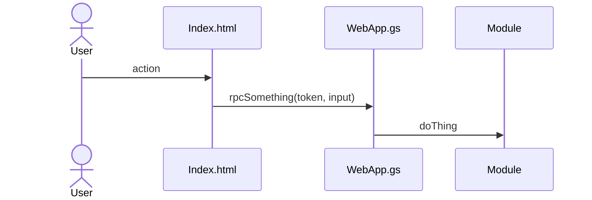

# Component name

> One sentence: what this does for the person using it.

<!-- Images come from scripts/docs/screens.js. Add an entry there for any new
     screen, then run `npm run docs:screenshots -- <name>`. Never paste a
     screenshot of the live store: no real names, wages or takings. -->

## What it does

What a cashier, manager or owner sees and can do, in their terms. Two or three
short paragraphs or a list. Point at the screenshot.

## How it works

The flow in prose, including anything non-obvious: ordering, caching,
what happens on failure.

## Data

| Tab | Reads | Writes |
|---|:-:|:-:|
| `table_name` | ✓ | ✓ |

Columns: [schema reference](../reference/schema.md#table_name).

## Rules it must not break

- The invariant, and why. Link the ADR if there is one.

## Code map

| What | Where |
|---|---|
| Server | `src/Module.gs`: `publicFn` |
| RPC | `src/WebApp.gs`: `rpcSomething` |
| UI | `src/Index.html`: `renderSomething` |

## Tests

| Suite | Holds down |
|---|---|
| `tests/suites/name.js` | what it guarantees |

## History

- Batch N / PR #N: what changed and why (one line each, newest first).
