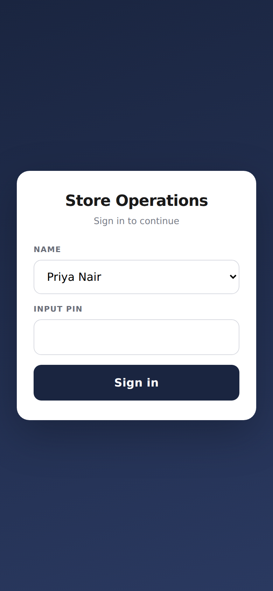
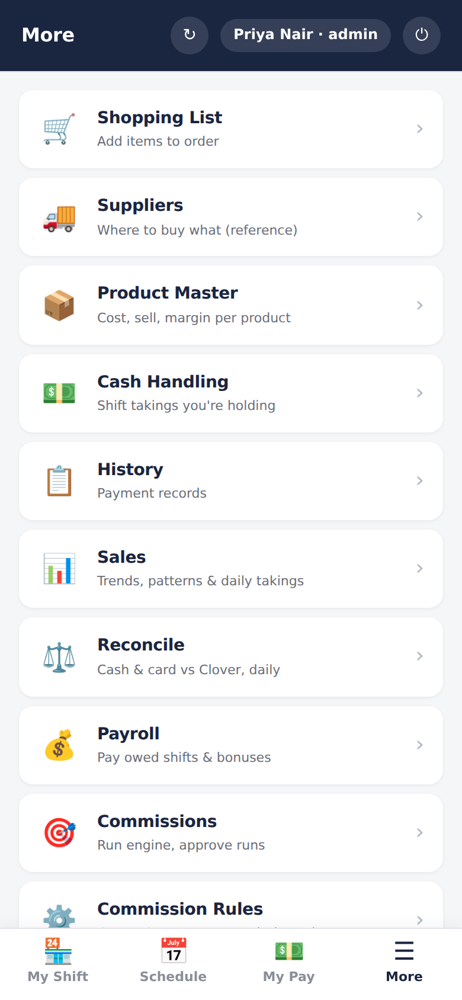
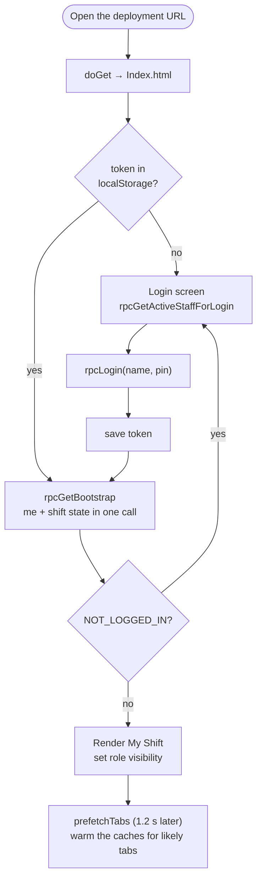

# App shell and auth

> One page that signs a person in with a PIN, shows them the tabs their role
> allows, and talks to the server through a small, cached RPC layer.

| Sign in | The More drawer (admin) |
|---|---|
|  |  |

## What it does

- **Sign in** with your name and a 4-digit PIN. The last name used is
  remembered on the device. After 5 wrong PINs in an hour, that name is locked
  for the rest of the hour.
- **Stay signed in** for a day of use. The session renews itself while you use
  the app, and a phone that discards the tab doesn't log you out.
- **Four tabs for everyone:** My Shift, Schedule, My Pay, More. The **More**
  drawer lists the screens your role can use; an employee sees Shopping List,
  Suppliers, Product Master, Cash Handling and History, and an admin sees
  everything.
- **Refresh** (↻) reloads the current screen; **⏻** signs out and clears the
  device.

## How it works

**The RPC layer** is two functions in `Index.html`:

- `call(method, ...args)` wraps `google.script.run` in a Promise. Any
  successful **write** clears the read cache, so the next screen can't show
  stale data.
- `cachedCall(method, args, ttl)` serves reads from a short-lived in-memory
  cache with three lifetimes (60 s live, 5 min semi, 30 min reference). It also
  **de-duplicates in-flight calls**, so a prefetch racing a tap makes one
  request, not two.

Any RPC that throws `NOT_LOGGED_IN` sends the user back to the login screen.
Other errors, `FORBIDDEN` included, show in place of the screen or as a toast.

**The server side** of every request is the same three lines: validate the
token, require a role, call the module with `actorId = session.staffId`. See
[security](../architecture/security.md) for sessions, lockout and the role
table.

## Data

| Store | Holds |
|---|---|
| `staff` | names, PINs, roles, active flag |
| Script properties | `session:<token>`, `loginFails:<name>` |
| `audit_log` | `login.success`, `login.fail` (with reason), `login.logout` |
| Browser `localStorage` | `storeops_token`, `storeops_last_name` |

## Rules it must not break

- **The role comes from the server session**, never from the client
  ([ADR-0002](../adr/0002-pin-login-with-server-side-sessions.md)).
- **Wrong name and wrong PIN get the same answer**, so the login can't be used
  to discover names.
- **Writes invalidate reads.** A cached read must never outlive a write the
  same person just made.
- **Hidden isn't enforced.** The drawer hides what a role can't use; the
  `Auth.require` in each RPC is what actually stops it.

## Code map

| What | Where |
|---|---|
| Server | `src/Auth.gs`: `login_`, `validate_`, `require_`, `logout_` · `src/Staff.gs`: `verifyLoginCode_` |
| RPC | `src/WebApp.gs`: `doGet`, `rpcGetActiveStaffForLogin`, `rpcLogin`, `rpcLogout`, `rpcGetMe`, `rpcGetBootstrap`, `_session` |
| UI | `src/Index.html`: `call`, `cachedCall`, `showLogin`, `enterApp`, `prefetchTabs`, `setupRoleVisibility`, `switchTab`, `handleRpcError`, `toast` |

## Tests

| Suite | Holds down |
|---|---|
| `rpc-guards` | no session gets nowhere; a role the client claims is ignored; per-RPC role checks for cash, products and imports |
| `routing` | what `doGet` serves for each `?v=` |

## History

- **Batch 6:** the token moves to `localStorage`, ending constant re-logins;
  the product catalogue is no longer loaded at login.
- **Batch 4:** the single-page web UI.
- **Batch 1:** auth, sessions, roles, audit log.
