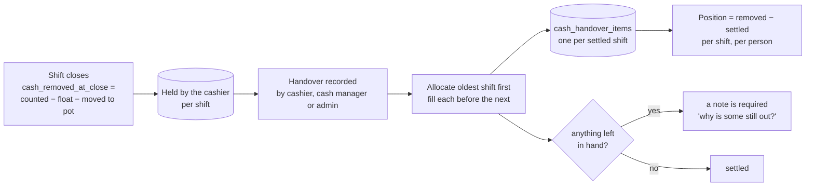

# Cash handling

> Track every dollar a cashier walks out with until it reaches the cash
> manager, shift by shift, with a record of who said it moved.

## What it does

At close, whatever the drawer holds beyond the float (and beyond anything moved
into the lotto pot) is **cash in hand**: the cashier takes it. The **Cash
Handling** screen shows:

- **Cash in your hands:** what you're holding, by till and by shift.
- **Out with staff** (cash manager and admin): everyone holding cash, the
  total, and the oldest shift still out. Shifts out longer than
  `cash_handover_stale_days` (default 7) are flagged.
- **Receive / Hand over:** record a handover. Either the cashier or the cash
  manager records it, and it takes effect at once.
- **All handovers:** the ledger, including who recorded each one. A wrong
  entry is **voided**, never deleted.

## How it works

The guards run **before** anything is written:

- you can't hand over more than you hold;
- a handover that leaves cash in hand needs a reason;
- only the cashier, the cash manager or an admin can record it;
- with no `cash_manager_staff_id` configured, there's nobody to hand to, and
  the error says which config key to set.

## Data

| Tab | Reads | Writes |
|---|:-:|:-:|
| `till_sessions` (`cash_removed_at_close`) | ✓ | |
| `cash_handovers` | ✓ | ✓ |
| `cash_handover_items` | ✓ | ✓ |
| `staff`, `config` | ✓ | |

## Rules it must not break

- **Oldest first**, the same walk payroll uses, so "which shift's cash is
  still out" always has an answer and not just a running total.
- **Never deleted.** Voiding flips the status, keeps the row, and releases
  its allocations.
- **`recorded_by` is permanent and shown on screen.** That replaces a
  two-party confirmation: the ledger says who claimed the money moved.

## Code map

| What | Where |
|---|---|
| Server | `src/CashHandling.gs`: `record_`, `voidHandover_`, `getOutstandingForStaff_`, `getAllOutstanding` |
| RPC | `src/WebApp.gs`: `rpcGetCashPosition`, `rpcRecordCashHandover`, `rpcVoidCashHandover`, `rpcGetCashOutstandingFor`, `rpcGetCashHandoverHistory` |
| UI | `src/Index.html`: `renderCashTab`, `cashHandoverRow`, `openHandoverSheet` |

## Tests

| Suite | Holds down |
|---|---|
| `cash-handling` | balance is what left the drawer; settlement oldest-first across every till; can't exceed what's held; preview and write agree; voiding returns the cash; missing tables degrade instead of throwing |
| `rpc-guards` | a cashier hands over only their own cash; the cash manager may record for anyone; voiding is cash manager or admin only; another person's balance is privileged |
| `public-report` | the 7-day report's cash section: who holds what, this week's handovers |

## History

- **Batch 8:** cash handling, "the other half of the drawer". Takings are
  tracked past the close for the first time.
