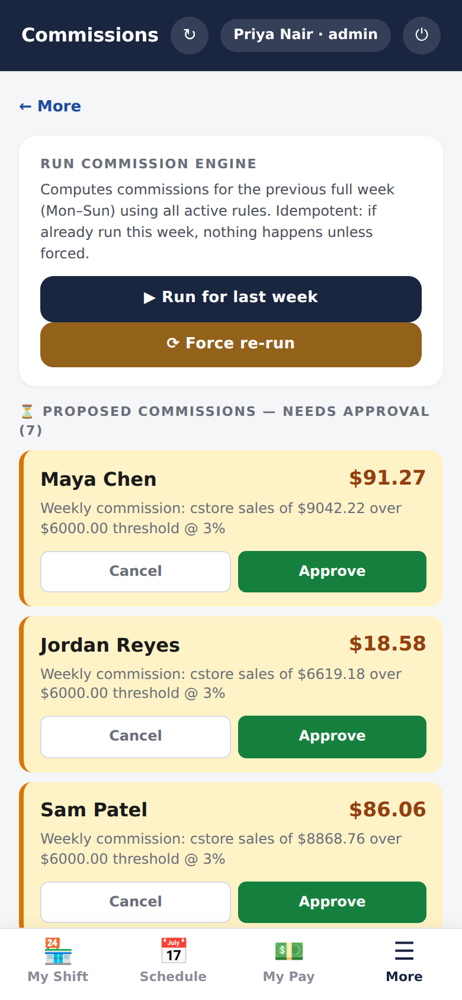
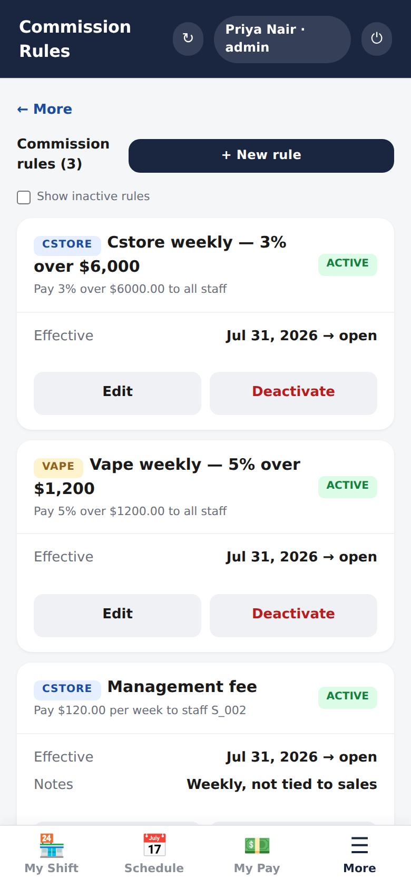
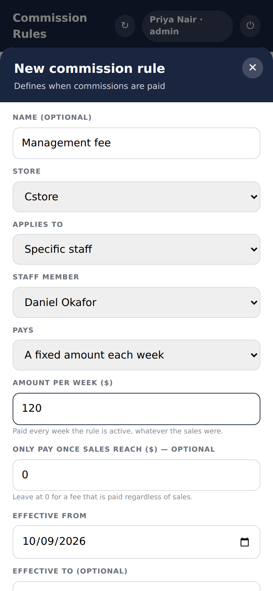
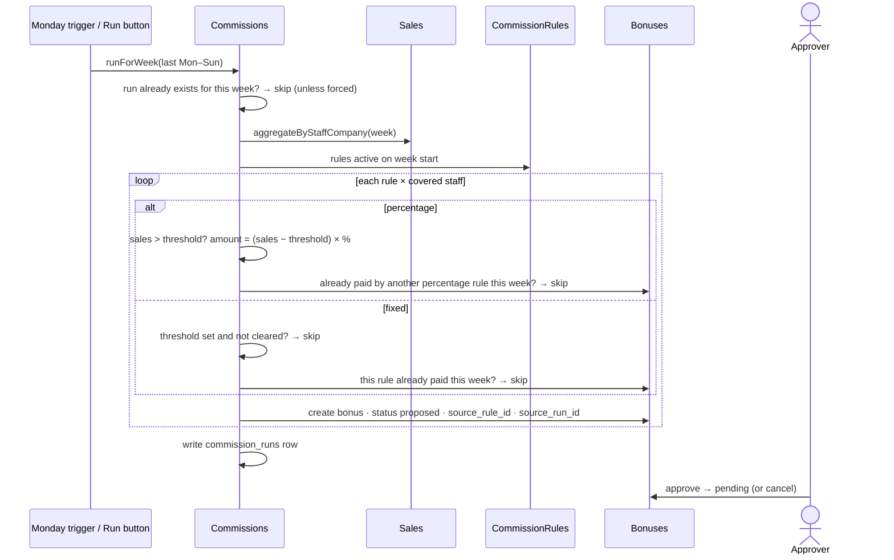

# Commissions

> Rules say who earns what. Each Monday the engine works out the week and
> **proposes** bonuses; a person approves them before anything is paid.

| Commission runs | Rules | A fixed weekly fee |
|---|---|---|
|  |  |  |

## What it does

A **rule** is one of two kinds:

| Kind | Says | Example |
|---|---|---|
| **Percentage** | For this person (or everyone) on this till, pay *n*% of weekly sales **above** a threshold | 3% of cstore sales over $6,000 |
| **Fixed** | Pay this person a flat amount every week, whatever the sales | $120 management fee |

A fixed rule with a threshold above zero pays only in weeks when sales clear
it, which gives "a flat bonus for a good week" from the same rule type. Rules
have an effective-from date and an optional end date; ending a rule stops it
from that week on.

The **Commissions** screen lists each weekly run and its **proposed** bonuses.
An approver (payroll admin or admin) approves or cancels each one. Approved
bonuses appear as owed on [Payroll](payroll.md) and on the person's My Pay.

## How it works

## Data

| Tab | Reads | Writes |
|---|:-:|:-:|
| `commission_rules` | ✓ | ✓ (rules screen) |
| `commission_runs` | ✓ | ✓ |
| `bonuses` | ✓ | ✓ |
| `sales`, `staff` | ✓ | |

## Rules it must not break

- **Proposed, never paid automatically**
  ([ADR-0011](../adr/0011-commissions-are-proposed-then-approved.md)). A wrong
  rule costs a cancelled proposal, not money.
- **One run per week.** Re-running needs `force`, and the per-rule guards still
  prevent duplicates.
- **A fee and a sales commission don't block each other.** Each bonus records
  the **rule** that produced it (`source_rule_id`), so a percentage rule
  ignores fee rows and a fee asks only whether *it* has paid this week
  ([ADR-0013](../adr/0013-fixed-amount-rules-record-their-source-rule.md)).
- **A deleted fee rule stops blocking anything**, and a legacy bonus with no
  rule ID still blocks as it always did.
- **A rule that would pay nothing is refused** at creation: a fixed rule needs
  an amount above zero, a percentage rule a percentage.

## Code map

| What | Where |
|---|---|
| Server | `src/Commissions.gs`: `runForWeek_`, `runForPreviousWeek`, `installWeeklyTrigger` · `src/CommissionRules.gs`: `create`, `update`, `getActiveOn` · `src/Bonuses.gs`: `existsCommissionFor`, approve and cancel |
| RPC | `src/WebApp.gs`: `rpcGetCommissionRuns`, `rpcRunCommissionEngine`, `rpcGetProposedBonuses`, `rpcApproveBonus`, `rpcCancelBonus`, `rpcGetCommissionRules`, `rpcCreateCommissionRule`, `rpcUpdateCommissionRule` |
| UI | `src/Index.html`: `renderCommissionsTab`, `triggerCommissionRun`, `renderRulesTab`, `openRuleForm` |
| Trigger | Sheet menu: **Install Weekly Auto-Trigger**; Mondays at `commission_run_hour` |

## Tests

| Suite | Holds down |
|---|---|
| `commission-fixed` | a fee pays with or without sales; fee and commission both pay; order doesn't matter; once per week; stops when the rule ends; inactive pays nothing; deleted rule stops blocking; legacy rows still block; threshold makes a fee conditional; percentage rules unchanged; zero-paying rules refused |

## History

- **#23 (Sep 2026):** fixed-amount rules, for a weekly management fee.
- **Batch 3:** weekly engine, rules, proposed → approved bonuses.
