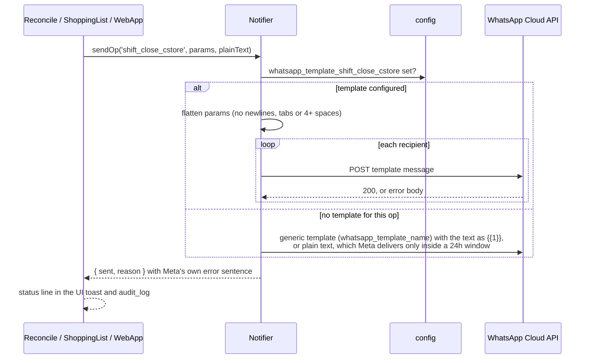

# Notifications

> The owner and manager get a WhatsApp message when a till opens, when the day
> is reconciled, and when the shopping list is sent. When a message fails, the
> app says that it failed.

An example close message for cstore, as the recipient sees it (fictional staff and figures):

```text
🧾 Shift Reconciliation
📅 Thu 8 Oct 2026

🏪 cstore
⏰ 08:00–22:15
👤 Maya Chen, Jordan Reyes

Σ Total sales
$4531.66 — cash $2005.37 · card $2526.29

💵 Cash · recorded / counted
$2255.37 / $2255.37 (var +$0.00) ✅
↳ float $250.00 back · $2005.37 in hand

🤝 Cash in hand
Sam Patel $2403.11 · Jordan Reyes $2229.16 · Maya Chen $1586.71

🎟 Lotto reserve
$500.00

💳 Cards
$2526.29 — single total, not independently verified

Result: ✅ Cash matched

StoreOps · automated
[ View 7-day report ]
```

## What it does

| Event | Template config key | Parameters |
|---|---|---|
| Till opened | `whatsapp_template_shift_open` | name, till, time |
| Day reconciled, cstore | `whatsapp_template_shift_close_cstore` | 11 |
| Day reconciled, vape | `whatsapp_template_shift_close_vape` | 12 (adds credit and debit lines; drops lotto) |
| Fallback for either till | `whatsapp_template_shift_close` | 13 |
| Shopping list generated | `whatsapp_template_shopping_list` | date·by, item lines, summary |

Every message goes to each number in `whatsapp_target_number`, so one field can
hold several recipients. The close message carries a **button** to the 7-day
[public report](public-reports.md); it's a static URL button, so adding it
didn't cost an extra template parameter.

The exact template bodies to submit to Meta, with sample values, are in the
[WhatsApp templates guide](../guides/whatsapp-templates.md).

## How it works



`Notifier.notify(event, payload)` is a separate path. It writes an audit entry
for internal events (`shift.opened`, `payment.recorded`,
`commission.computed`) and sends nothing outside.

## Rules it must not break

- **The parameter shape follows the template, not the till's state**
  ([ADR-0007](../adr/0007-message-shape-follows-the-template.md)). A wrong
  parameter count gets an `http_400` from Meta, and before this rule the day
  reconciled with no sign that the message never arrived.
- **A failed send says why.** The result carries Meta's error message, and
  the UI shows "Reconciled · WhatsApp NOT sent — <reason>" instead of a ✓.
- **Parameters are flattened.** Meta rejects template parameters that contain
  newlines, tabs or long runs of spaces, and shows `*bold*` literally. An empty
  parameter is sent as `—` so the call isn't rejected.
- **Notifications never block the work.** A failed send never undoes a close
  or a reconcile.

## Code map

| What | Where |
|---|---|
| Server | `src/Notifier.gs`: `sendOp`, `sendTemplate`, `notify`, `dispatch_`, `apiError_` |
| Callers | `src/Reconcile.gs` (close), `src/ShoppingList.gs` (list), `src/WebApp.gs`: `rpcNotifyShiftOpen` |

## Tests

| Suite | Holds down |
|---|---|
| `notifier` | the wire payload, flattening, recipients, what a Meta rejection reports back |
| `reconcile` | parameter count per template, shape follows the template, fallback key and shape |
| `link` | the report button: right view appended, or no link at all |
| `template-guard` | the Apps Script templating contract the pages rely on |

## History

- **#14–#16:** send the parameter count the template expects; bind the shape to
  the template; keep Meta's sentence that identifies the fault.
- **#12 (Batch 13):** one close template per till.
- **Batch 8:** the close message rebuilt on 13 parameters.
