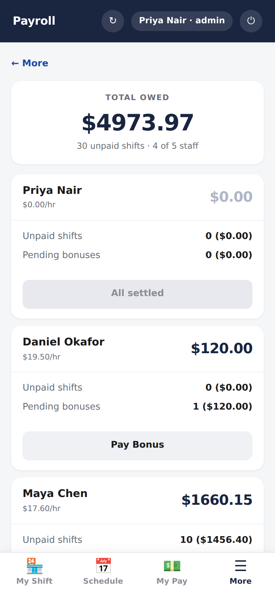
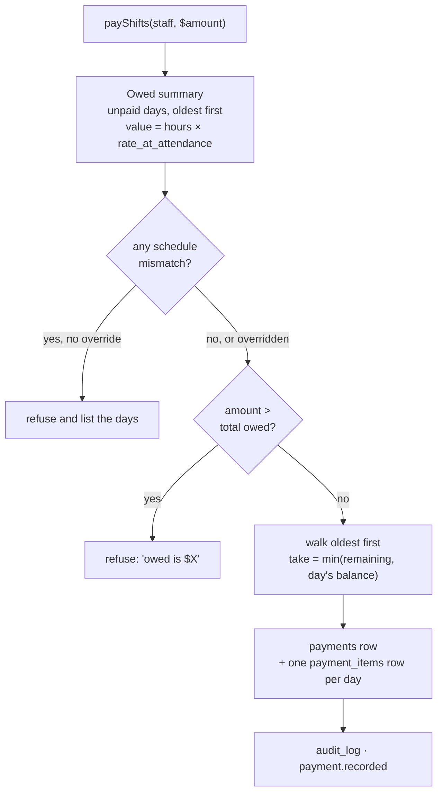

# Payroll

> Pay people for the days they worked, oldest first, and let each person check
> the arithmetic for themselves.

| Payroll (admin) | My Pay (everyone) |
|---|---|
|  |  |

## What it does

**My Pay** is available to everyone and shows only your own pay: hourly rate,
every unpaid shift with *hours × rate = value*, how much of it has been paid,
and pending bonuses and commissions. Anyone can check their pay against their
own memory of the week.

**Payroll** (admin and payroll admin) lists what each person is owed and records
payments in one of two ways:

- **Pay shifts:** enter an amount. It is applied to that person's **oldest
  unpaid day first**, filling each day before the next; the last day may be
  part-paid. Paying more than is owed is refused, and the error states the
  amount owed.
- **Pay a bonus:** pay one specific bonus, commission or fee, in full or in
  part.

If any unpaid day has **scheduled hours that differ from actual hours**, paying
shifts stops and shows the days. The admin either fixes the hours on the
[schedule](schedule-and-attendance.md) or overrides with a reason. A payment
can be **undone**; its items are removed and the days become unpaid again.

## How it works

A day is paid when its `payment_items` (type `shift`) add up to
`hours_worked × rate_at_attendance`. A bonus is paid when its items add up to
its amount, and its status moves `pending → paid`.

## Data

| Tab | Reads | Writes |
|---|:-:|:-:|
| `attendance` | ✓ | |
| `bonuses` | ✓ | ✓ (status) |
| `payments` | ✓ | ✓ |
| `payment_items` | ✓ | ✓ |

## Rules it must not break

- **Oldest first**, so "which days are unpaid" always has one answer.
- **No overpayment**, of shifts or of a bonus.
- **Rates are snapshotted** on the attendance row, so a payment always prices
  a day at the rate it was worked.
- **Bonuses are never paid with shifts.** They are separate flows, so a shift
  payment can't quietly settle a commission.
- **Only `pending` bonuses are payable.** A `proposed` one is refused with
  "Approve it first", so nothing the [commission engine](commissions.md)
  computes is paid until a person approves it.

## Code map

| What | Where |
|---|---|
| Server | `src/Payments.gs`: `getOwedSummary_`, `payShifts_`, `payBonus`, `undo` · `src/Bonuses.gs` |
| RPC | `src/WebApp.gs`: `rpcGetPayrollOverview`, `rpcGetOwedSummary`, `rpcPayShifts`, `rpcPayBonus`, `rpcUndoPayment`, `rpcGetMyOwedSummary`, `rpcGetPaymentHistory` |
| UI | `src/Index.html`: `renderPayrollTab`, `renderPayShiftsForm`, `renderPayMismatch_`, `openPayBonusList`, `renderMyPayTab`, `renderHistoryTab` |

## Tests

Payroll has no dedicated suite yet. The allocation walk is the one
`cash-handling` tests for handovers, and `rpc-guards` covers who can call
the payroll RPCs. A payroll suite (oldest-first, overpayment, mismatch guard,
undo) is on the [backlog](../guides/docs-process.md#known-gaps).

## History

- **Oct 2026:** My Pay fits a phone: tiles two-by-two, and the shift table stays
  on one line.
- **Batch 4:** payroll and My Pay screens.
- **Batch 3:** payments with oldest-first allocation; bonuses.
