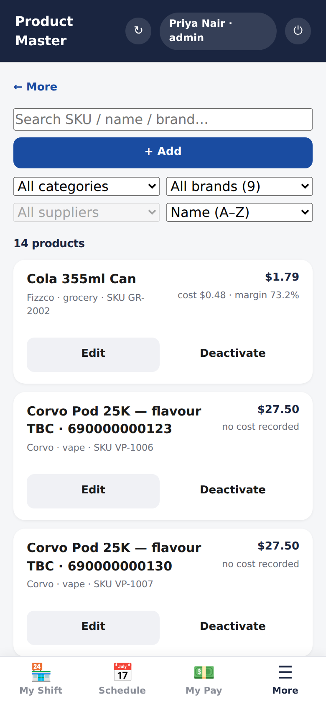
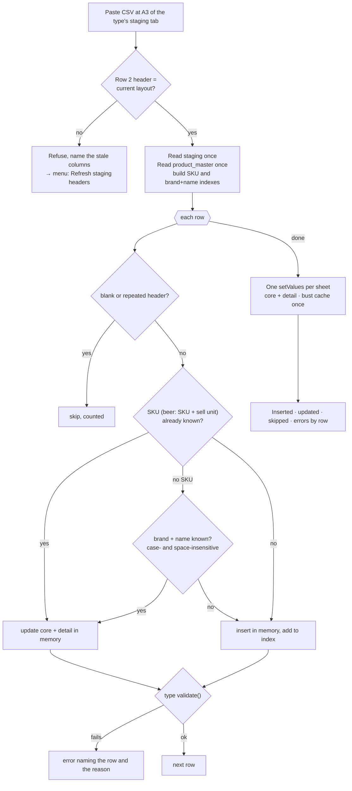

# Product master

> One catalogue of everything the store sells, with cost, price and margin
> worked out from the inputs each kind of product actually has.

## What it does

**Product Master** lists every product with its sell price, cost and margin.
You can search by SKU, name or brand, filter by category, brand or supplier,
and sort by name, margin or price. Anyone signed in can **add** or **edit** a
product, since cashiers add most new stock. Managers and admins can
**deactivate** one.

The edit form changes with the category, because each kind of product is
priced differently:

| Category | You enter | The app works out |
|---|---|---|
| **Vape** | line, form factor, puffs, mL, nicotine, flavour, purchase and sale price | margin |
| **Beer** | LCBO case price, units per case, deposit, target margin | unit cost, sell price incl. deposit |
| **Cigarettes** | cost per carton, packs per carton, target margin | cost per pack, sell price |
| **Grocery / other** | cost and sell price | margin |

A product missing its name or variant (for example *"flavour TBC"*) can be
flagged **needs detail**. It stays in the catalogue and in the
[picker](shopping-list.md), but it can't be ordered until someone fills it in.
A product with no recorded cost shows *no cost recorded* instead of a 100%
margin.

## How it works

Every write goes through the type's `validate` and `derivePricing` in
`ProductTypes.gs`, then writes the core row and the detail row and audits both.
Lists read the core table from a 10-minute cache; opening one product loads its
detail.

### Bulk import

Hundreds of products arrive as a supplier CSV. An admin pastes it into that
type's staging tab (`_pm_vape_staging`, …) at A3 and runs **📦 Import
<type>** from the sheet menu.

## Data

| Tab | Reads | Writes |
|---|:-:|:-:|
| `product_master` | ✓ | ✓ |
| `product_vape_detail`, `product_beer_detail`, `product_cigarettes_detail` | ✓ | ✓ |
| `_pm_<type>_staging` | ✓ | |

## Rules it must not break

- **The core is thin, and detail lives per type**
  ([ADR-0012](../adr/0012-product-core-plus-per-type-detail.md)). Lists and
  search read only the core table; detail is loaded when one product is opened.
- **Prices are derived on every write** by the type's `derivePricing`. The
  stored margin columns exist only so that people sorting the Sheet see
  numbers; the code never trusts them across writes.
- **Imports read once and write once**
  ([ADR-0010](../adr/0010-bulk-import-reads-once-writes-once.md)). The import
  used to re-read the master twice per row, 667 reads for 222 rows. It now
  takes a fixed number of reads however long the paste is.
- **A stale header is refused, never guessed at**
  ([ADR-0009](../adr/0009-staging-imports-are-header-driven.md)). A paste
  under a header from an older layout used to be mapped silently into the
  wrong columns.
- **`needs_detail` is a stored flag, not a guess from the name**
  ([ADR-0015](../adr/0015-needs-detail-is-a-stored-flag.md)).

## Code map

| What | Where |
|---|---|
| Server | `src/ProductMaster.gs`: `create`, `update`, `getWithDetail`, `importFromStaging` · `src/ProductTypes.gs`: per-type `derivePricing`, `validate`, `fieldSchema` |
| Menu | `src/Setup.gs`: `menu_importVape` and siblings, `menu_refreshStagingHeaders`, `menu_diagnoseVapeStaging` |
| RPC | `src/WebApp.gs`: `rpcGetProductMaster`, `rpcGetProduct`, `rpcCreateProduct`, `rpcUpdateProduct`, `rpcDeactivateProduct`, `rpcGetProductTypeSchema` |
| UI | `src/Index.html`: `renderProductsTab`, `openProductForm` |

## Tests

| Suite | Holds down |
|---|---|
| `import-perf` | reads and writes don't grow with the paste; SKU and brand+name dedup; junk rows skipped; failing rows named; stale header refused; re-import is as cheap |
| `ui-products` | no cost is "no cost recorded", not a 100% margin; margin sort ranks uncosted last |
| `shopping-gate` | a needs-detail product can't be ordered until it is completed |
| `rpc-guards` | anyone can add or correct a product, only a manager can remove one, bulk import is admin-only |

## History

- **Oct 2026:** "no cost recorded" instead of a 100% margin.
- **#19–#22 (Sep 2026):** the whole vape shelf is orderable; failed imports
  name their rows; stale staging headers are refused; imports stop timing out.
- **Batch 10:** the import's per-row re-reads are removed.
- **Batch 5:** product master v2: core plus per-type detail.
