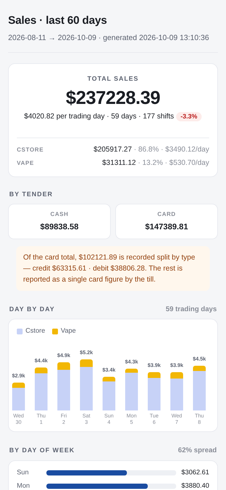
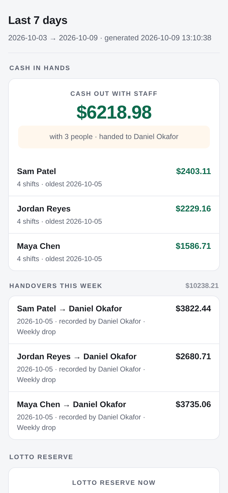
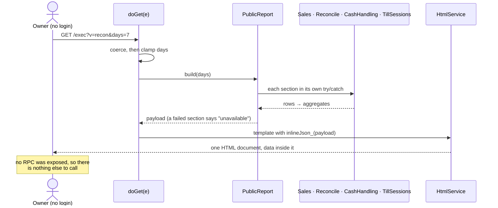

# Public reports

> Two read-only pages for owners and partners who need the numbers but
> shouldn't need a PIN: how trade is going, and whether this week's cash and
> tills reconciled.

| `?v=sales`: last 60 days | `?v=recon`: last 7 days |
|---|---|
|  |  |

The full sales page, top to bottom: [public-sales-full.png](../images/public-sales-full.png).

## What it does

| Page | URL | Shows | Default window |
|---|---|---|---|
| **Sales** | `<deployment>/exec?v=sales` | Total, per till, cash vs card, the day-by-day chart, and the same four insights as the [dashboard](sales-dashboard.md) | 60 days, `?days=` 1–365 |
| **7-day report** | `<deployment>/exec?v=recon` | Who holds how much cash, this week's handovers, the lotto pot day by day with the cashiers' notes, and each shift's reconcile result | 7 days, `?days=` 1–31 |

The close message's **View report** button links to `?v=recon`
([notifications](notifications.md)). Both pages are plain, fast, and built for a
phone.

## How it works

## Data

Reads `sales`, `validation_results`, `till_sessions`, `cash_handovers`,
`cash_handover_items`, `staff`. Writes nothing.

## Rules it must not break

- **Data is inlined, never fetched**
  ([ADR-0003](../adr/0003-public-pages-inline-their-data.md)). The pages
  expose no RPC, so a session-less caller can't reach anything except these
  two documents.
- **The sales page publishes aggregates only:** no staff names or IDs, no
  session or sales IDs. The rows are never fetched.
- **Inlined text can't end the script.** `<` is written as `<`, so a note
  containing `</script>` stays text ([security](../architecture/security.md#the-public-pages)).
- **A card figure nothing measured is omitted, not zeroed.** A till with no
  Clover shows *not verified* instead of a fictional loss.
- **One failing section never takes the page down,** and an anonymous reader
  never sees a stack trace.
- **The app and the page agree** on every figure and sign (`parity`).

## Code map

| What | Where |
|---|---|
| Server | `src/PublicReport.gs`: `build_`, `buildSales_`, `reconcileSection_`, `cashSection_`, `reserveSection_` |
| Routing | `src/WebApp.gs`: `doGet`, `publicReconPage_`, `publicSalesPage_`, `inlineJson_` |
| Pages | `src/Public.html`, `src/PublicSales.html` |

## Tests

| Suite | Holds down |
|---|---|
| `public-report` | aggregates only; the window; sections fail politely; unmeasured cards omitted |
| `public-inline` | a hostile note can't close the script, and arrives intact |
| `public-render` | the whole sales page renders, rather than going blank |
| `public-chart` | bar labels, proportional heights, opening on the newest day |
| `routing` | what each `?v=` serves; the window is clamped; failures degrade to a message |
| `parity` | the app and the page render one payload the same way |
| `template-guard` | the unescaping scriptlet, and no scriptlet syntax inside comments |
| `reconcile` | the real reconcile rows through the real report: blank stays blank |

## History

- **Oct 2026:** inlined data escapes `<`; unmeasured card figures are no
  longer published as a $0 measurement.
- **#17 (Sep 2026):** the sales page rendered blank; the whole render is now
  tested (`public-render`).
- **#7–#9 (Aug 2026):** `?v=sales` becomes the public sales dashboard, with
  labelled bars. A comment containing scriptlet syntax had broken both
  templates; `template-guard` now pins the contract.
- **Batch 9:** the 7-day report, linked from the close message.
