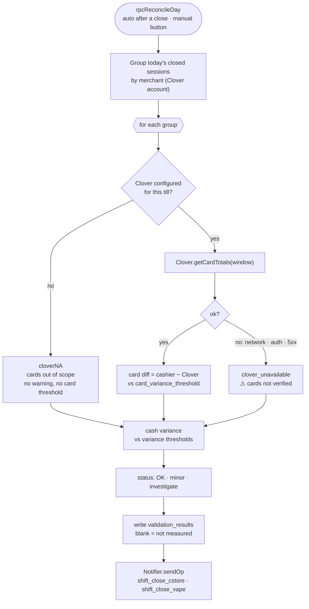

# Reconcile

> After every close, compare what the cashier entered against something that
> measured it independently, and say plainly what was checked and what wasn't.

## What it does

The **Reconcile** tab (managers and above) lists every reconciled shift, newest
first. Each row shows **claimed / measured** and the difference, for cash and
for cards:

- **Cash** is always measured: the cashier's own count against what the drawer
  should hold.
- **Cards** are measured only on a till connected to **Clover** (vape). The
  app asks Clover for the card payments in that shift's time window and
  compares credit, debit and total.
- **A till with no Clover** (cstore on ePOS) shows its card total with **not
  verified**. It doesn't show $0.00 measured, and it doesn't show a red
  shortfall the size of the day's card takings.

**Reconcile today** reruns the check by hand, even if tills are still open.

## How it works

Three outcomes for the cards, and they must stay distinct:

| Situation | Status | Card columns | Message says |
|---|---|---|---|
| Till has no Clover | from cash alone | blank | card figure, no variance |
| Clover answered | from cash **and** cards | filled | claimed / measured (var) |
| Clover failed | `clover_unavailable` | blank | ⚠️ Clover unavailable |

## Data

| Tab | Reads | Writes |
|---|:-:|:-:|
| `till_sessions`, `sales` | ✓ | |
| `validation_results` | ✓ | ✓ |
| `cash_handovers` (cash in hand, for the message) | ✓ | |

## Rules it must not break

- **"Not configured" is not "unavailable."** Warning every day about a till
  that was never meant to have Clover teaches everyone to ignore the warning
  line.
- **Blank is not zero**, on write and on read
  ([ADR-0004](../adr/0004-blank-is-not-zero.md)). `getRecent_` reads the Clover
  columns back as `null`. Reading them as `0` once made both the in-app history
  and the public report show every cstore day as a total loss.
- **The roll-up covers cash too.** A drawer $40 short is never "All matched",
  however the cards came out.
- **Clover never blocks a close.** `Clover.gs` never throws; it returns
  `{ ok:false, error }`.

## Code map

| What | Where |
|---|---|
| Server | `src/Reconcile.gs`: `reconcileDay`, `getRecent_` · `src/Clover.gs`: `getCardTotals`, `merchantFor` |
| RPC | `src/WebApp.gs`: `rpcReconcileDay`, `rpcGetReconciliation` |
| UI | `src/Index.html`: `renderReconPanel`, `reconGroupDetail_`, `pairVar_` |

## Tests

| Suite | Holds down |
|---|---|
| `reconcile` | not-configured vs outage, no fictional variance, a real shortfall still surfaces, blank round-trips as null through the sheet and the public report |
| `ui-recon` | the history cell: "not verified" for a till with no Clover, red only for a real difference, a measured zero is a match |
| `parity` | the app and the public page agree on every figure and sign |

## History

- **Oct 2026:** unmeasured card figures read back as `null`, not `$0`. The
  in-app history and the public report had shown cstore's whole card take as a
  shortfall every day.
- **#12 (Batch 13):** cstore has no Clover; "not configured" is separated from
  "unavailable".
- **Batch 9:** Reconcile becomes its own tab; claimed / measured (var) for both
  cash and cards.
- **Batch 5:** reconciliation against Clover per shift window.
