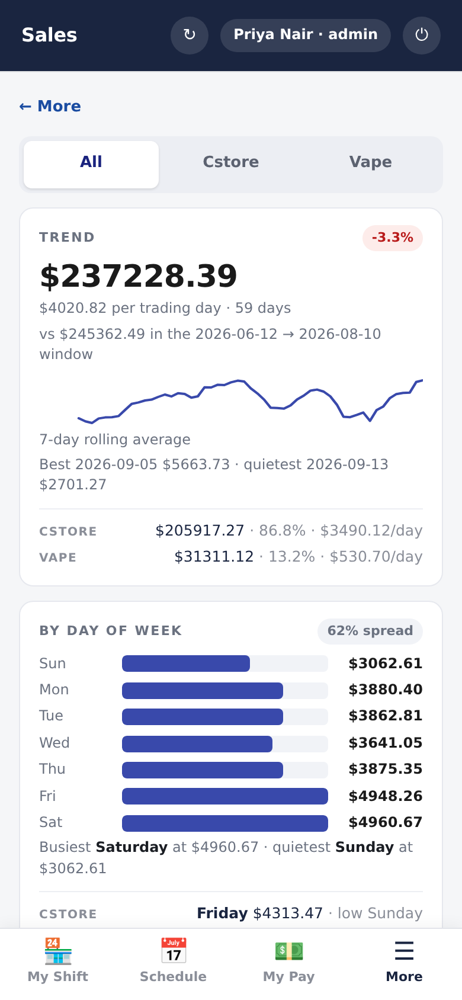
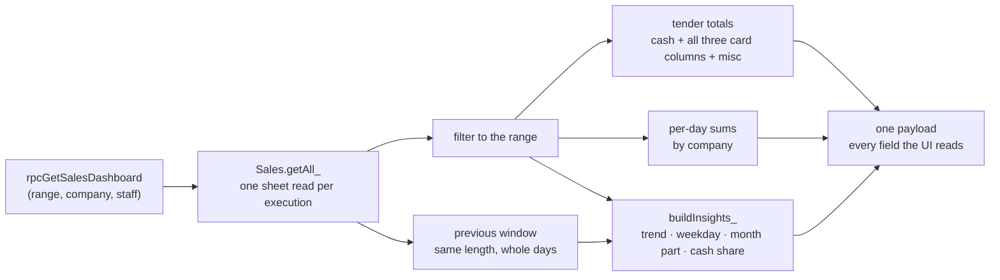

# Sales dashboard

> How trade is going, in the four questions a corner store acts on: is it
> up or down, which days are busy, which part of the month, and how much
> comes in as cash.

| Phone | Desktop |
|---|---|
|  |  |

## What it does

**Sales** (managers and above) opens on the last 60 days for both tills. The
**All / Cstore / Vape** toggle switches company; dates and staff are filters.

| Insight | Answers | Guard against a misleading number |
|---|---|---|
| **Trend** | Up or down against the previous window of the same length, with a 7-day rolling average | Averages divide by **days that traded**, so a closed week isn't read as a collapse |
| **By day of week** | Busiest and quietest weekday, per till | Per trading day, not per calendar day |
| **By part of month** | Days 1–10, 11–20, 21–end, which is where paydays show | Hidden below 28 trading days, with the reason given |
| **Paid in cash** | Cash share of takings and its drift | Changes are in **percentage points** (`-0.1 pts`), not percent |

The whole phone view, top to bottom:
[sales-insights.png](../images/sales-insights.png).

Below the insights are the **tender tiles** (total, cash, card, misc) and a
**day chart** that opens on the newest day and labels every bar with its
amount. Tapping a day lists its shifts.

The tiles stay continuous across the cstore ePOS change: a range that mixes
split days and single-total days shows one **Card** tile, and a Credit/Debit
breakdown only for the days that had one.

## How it works

## Data

| Tab | Reads | Writes |
|---|:-:|:-:|
| `sales` | ✓ | |
| `staff` (names for the filter) | ✓ | |

## Rules it must not break

- **Sum all three card columns** (credit, debit, card total) and their misc
  counterparts. Reading only credit and debit undercounts every ePOS day and
  looks like a decline rather than a bug
  ([ADR-0005](../adr/0005-card-shapes-are-mutually-exclusive-columns.md)).
- **Short ranges say so** instead of drawing a confident line through three
  points.
- **The RPC forwards every field the UI reads.** A hand-written projection
  once dropped `insights`, which were computed on every request and then
  thrown away.
- **One sheet read per load**, however long the range
  ([ADR-0016](../adr/0016-per-execution-caches-for-read-paths.md)).

## Code map

| What | Where |
|---|---|
| Server | `src/Sales.gs`: `getDashboard`, `buildInsights_`, `aggregateByStaffCompany` |
| RPC | `src/WebApp.gs`: `rpcGetSalesDashboard` |
| UI | `src/Index.html`: `renderSalesScaffold`, `renderSalesInsights`, `renderSalesBody`, `barChart_`, `sparkline_`, `seedSalesFilters_` |

## Tests

| Suite | Holds down |
|---|---|
| `sales-insights` | weekday averages per trading day; the day-10 boundary; short ranges suppressed; trend window; per-company split |
| `sales-cards` | two card shapes, one continuous total |
| `ui-dashboard` | tiles never drop a tender mid-range; the chart opens on the newest day |
| `perf` | one read per load; a write invalidates the cache; cost doesn't grow with the range |
| `wiring` | the RPC forwards every `data.*` field `Index.html` reads |

## History

- **#7, #8 (Aug 2026):** split by company without losing the consolidated
  view; the chart opens on the newest days.
- **Batch 10:** one read per load; the default window is 60 days.
- **Batch 9:** the four insights; Sales and Reconcile become separate tabs.
