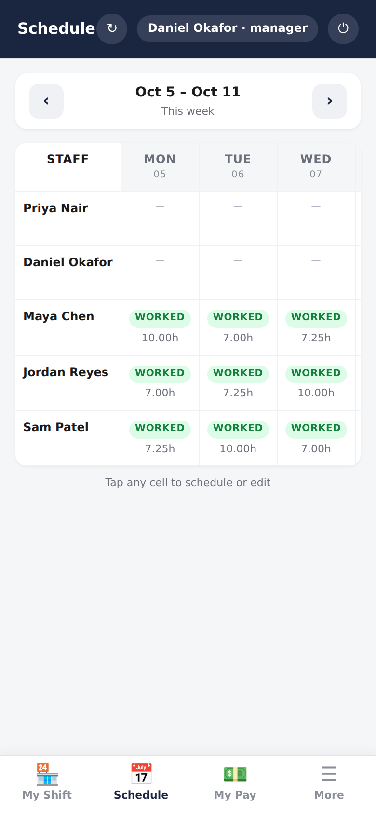
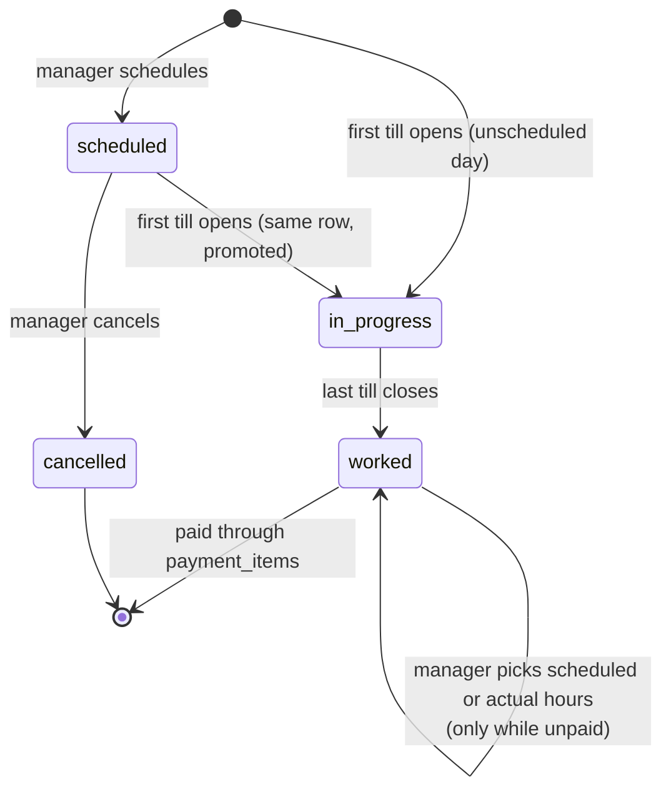

# Schedule and attendance

> Plan the week, then let the tills record who actually worked and for how
> long. That record is what payroll pays against.

## What it does

The **Schedule** tab is one week per screen, a row per person and a column per
day. Everyone can see it. Managers and admins tap a cell to:

- **schedule** a shift ahead of time (start and end time);
- **cancel** a scheduled shift that didn't happen;
- when the scheduled and actual hours differ, **choose which one counts**,
  scheduled or actual;
- (admin only) **correct the clock times** of a worked day.

Worked days show **WORKED** with the hours that will be paid.

## How it works

- The attendance ID is **deterministic**: `A_<yyyyMMdd>_<staff>`. A scheduled
  day and the till opening that day land on the **same row**, so a scheduled
  shift can never be paid twice.
- **Hours are wall-clock**, from the first till opening to the last till
  closing. A cashier who runs cstore and vape from 09:00 to 17:00 worked 8
  hours, not 16.
- The **rate is snapshotted** (`rate_at_attendance`) when the day completes.
  A raise next month doesn't re-price this month.
- **`hours_basis`** records whether a manager chose `scheduled` or `actual`.
  Editing the clock times clears it, so the day gets reviewed again.

## Data

| Tab | Reads | Writes |
|---|:-:|:-:|
| `attendance` | ✓ | ✓ |
| `staff` (rate) | ✓ | |
| `payment_items` (is it paid?) | ✓ | |

## Rules it must not break

- **No change to a paid day.** Adjusting hours on a day with any payment
  against it is refused with the amount already paid; undo the payment first.
- **Every change is audited** with before and after (`attendance.adjust_hours`,
  time edits).
- **Cancelled days are ignored by payroll.**

## Code map

| What | Where |
|---|---|
| Server | `src/Attendance.gs`: `openOrPromote_`, `schedule_`, `complete_`, `cancel_`, `adjustHours_`, `editActualTimes_` |
| RPC | `src/WebApp.gs`: `rpcGetWeekSchedule`, `rpcScheduleShift`, `rpcCancelScheduledShift`, `rpcAdjustAttendanceHours`, `rpcEditAttendanceTimes` |
| UI | `src/Index.html`: `renderScheduleTab`, `editScheduleCell` |

## Tests

No dedicated suite yet; attendance is exercised through the close
(`wiring`, `lotto-payout`) and payroll. A suite for the state machine and the
paid-day guard is on the [backlog](../guides/docs-process.md#known-gaps).

## History

- **Batch 4:** schedule grid in the web UI.
- **Batch 2:** attendance as the payroll source of truth; completes on the last
  close.
