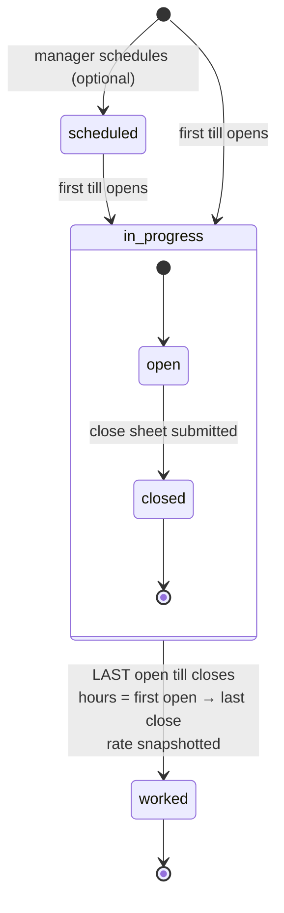

# Shifts and the close

> A cashier opens a till, works the shift, and closes it in one sheet. The app
> works out what the drawer should hold and says at once whether it balances.

| My Shift | The close sheet |
|---|---|
|  |  |

## What it does

**My Shift** shows one card per counter the cashier is allowed to run. Opening
a till confirms the float ($250 cstore, $100 vape by default). At the end of the
shift the cashier fills in the **close sheet**:

- **Cash sales** and **card sales** from the till's end-of-day report. A till
  that splits cards asks for credit and debit; cstore on ePOS asks for one card
  total.
- **Misc sales** (collapsed by default) for anything rung up outside the POS.
- **Lotto reserve** (cstore only): the pot is counted, and a count that differs
  from the last one needs a reason.
- **Cash counted in till.**

The summary at the bottom updates as they type: expected cash, what the pot
contributed, the variance, and where the counted cash goes (float stays, the
rest is **in hand** until it is handed over).

The screenshot shows the hard case. A $900 winning ticket was paid that shift,
so cash sales are **−$180** (the **−** button exists because phone number pads
have no minus key). The pot went from $500 to $300 and fed $200 to the drawer.
$250 + (−$180) + $200 = $270 expected; $270 counted; **+$0.00**.

## How it works



1. `rpcOpenShift` → `TillSessions.open` creates `CST-` or `VAP-<date>-<staff>`
   and creates or promotes today's `attendance` row. The ID is deterministic,
   so a double tap can't open two sessions.
2. `rpcCloseShift` → `TillSessions.close` computes:

   ```
   reserve_fed   = (last count + last top-up) − this count     (cstore only)
   expected_cash = float + cash_sales + misc_cash − cashback + reserve_fed
   variance      = counted − expected     → OK / minor / investigate
   ```

   writes the `sales` row (one card shape per row, see
   [ADR-0005](../adr/0005-card-shapes-are-mutually-exclusive-columns.md)), and,
   if this was the person's last open till, completes the attendance.
3. The client then calls `rpcReconcileDay(auto)`, which reconciles the day and
   sends the close message ([reconcile](reconcile.md),
   [notifications](notifications.md)).

The variance bands come from `variance_ok_threshold` and
`variance_minor_threshold` in config.

## Data

| Tab | Reads | Writes |
|---|:-:|:-:|
| `till_sessions` | ✓ | ✓ |
| `sales` | ✓ | ✓ |
| `attendance` | ✓ | ✓ |
| `config` (floats, thresholds, card split) | ✓ | |

## Rules it must not break

- **A payout is netted into cash sales**, and only cstore's `cash_sales` may go
  negative. Every other money field strips a minus sign, and the server rejects
  a negative on vape.
- **The reserve is derived from two counts, never typed as "fed"**
  ([ADR-0008](../adr/0008-lotto-reserve-is-derived-from-two-counts.md)). The
  last top-up counts as part of the starting balance, or a topped-up pot is
  understated by exactly the top-up.
- **Hours are wall-clock**, from the first open to the last close. Running two
  tills doesn't double the hours.
- **One shift per person per till per day.**
- **The card shape comes from config at write time**, and each row records
  which shape it used, so history before and after a till change stays readable.

## Code map

| What | Where |
|---|---|
| Server | `src/TillSessions.gs`: `open_`, `close_`, `getLottoLog_` · `src/Sales.gs`: `write_` · `src/Attendance.gs`: `openOrPromote`, `complete` |
| RPC | `src/WebApp.gs`: `rpcGetMyShiftState`, `rpcOpenShift`, `rpcCloseShift`, `rpcNotifyShiftOpen` |
| UI | `src/Index.html`: `renderShiftTab`, `renderShiftCard`, `openShiftForm` |

## Tests

| Suite | Holds down |
|---|---|
| `lotto-payout` | netting, reserve fed from two counts, no double-counted top-up, the two guards |
| `sales-cards` | the two card shapes and one continuous total |
| `ui-close-sheet` | the form as shipped: sign button, which inputs strip a minus, the live summary |
| `wiring` | every close-sheet field reaches the server and the sales row |

## History

- **#12, #13 (Batch 13):** cstore moves to ePOS with one card figure. A lotto
  top-up was being counted twice; fixed.
- **#10, #11 (Batch 13):** a lotto payout may exceed the day's takings; sign
  button.
- **Batch 7:** close-sheet input fixes and the daily lotto reserve log.
- **Batch 2:** shift lifecycle; attendance completes on the last close.
