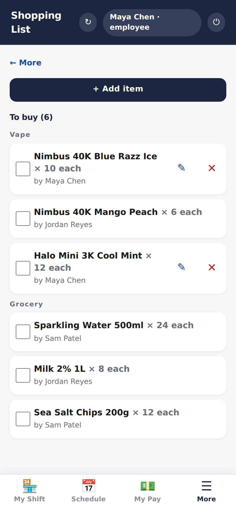
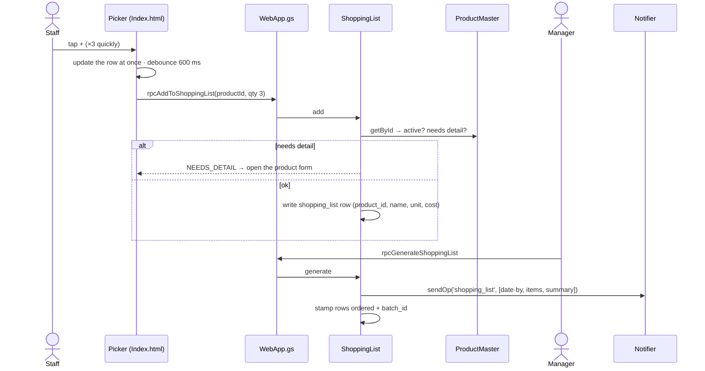

# Shopping list

> Anyone who notices something running low adds it from the catalogue in a
> tap; a manager sends the list as one WhatsApp message.

| The list | The picker |
|---|---|
|  |  |

## What it does

**The list** groups pending items by category and shows the quantity and who
added each one. Items can be ticked off as bought, edited or removed. Removing
is instant, with **Undo** in the toast.

**The picker** is a sheet that stays open while you add:

- **Category chips** (Vape, Cigarettes, Beer, Grocery, Other). Tapping one
  shows the **whole** category, so a full vape shelf can be browsed without
  typing.
- **Search** narrows within the chip by name, brand, SKU or barcode. Every
  term must match.
- **+** adds one; the row turns into a **− qty +** stepper. Taps are written
  optimistically and debounced, so several quick taps make one call.
- A product flagged **needs details** is listed (so nobody creates a duplicate)
  but shows **Fix** instead of **+**. Fix opens the product form; once the
  flavour or variant is filled in, it can be ordered.
- **Create new product** opens the same form when something isn't in the
  catalogue yet.

A manager or admin taps **Generate**. The pending items become copyable text,
are sent through the shopping-list WhatsApp template, and are stamped
`ordered` with a shared batch ID. History is kept rather than deleted.

## How it works

The picker loads a slim 8-field projection of the catalogue
(`rpcGetProductsForPicker`) when the Shopping tab is first opened, not at login.

## Data

| Tab | Reads | Writes |
|---|:-:|:-:|
| `shopping_list` | ✓ | ✓ |
| `product_master` | ✓ | |

## Rules it must not break

- **An incomplete product can't be ordered.** The server refuses it with its
  own `NEEDS_DETAIL` reason, so the client's redirect to the form is backed by
  the server and not just a suggestion.
- **An inactive product can't be ordered.**
- **Generating never deletes.** Rows move to `ordered` with a batch ID;
  removing one by hand marks it `removed`.
- **A missing cost isn't shown as free** in the picker.

## Code map

| What | Where |
|---|---|
| Server | `src/ShoppingList.gs`: `add_`, `edit_`, `removeEntry_`, `setBought_`, `generate_`, `clearAll_` |
| RPC | `src/WebApp.gs`: `rpcGetShoppingList`, `rpcAddToShoppingList`, `rpcEditShoppingListEntry`, `rpcRemoveShoppingListEntry`, `rpcSetShoppingItemBought`, `rpcGenerateShoppingList`, `rpcClearShoppingList`, `rpcGetProductsForPicker` |
| UI | `src/Index.html`: `renderShoppingTab`, `openAddShoppingItem`, `openEditShoppingItem`, `generateShoppingList` |

## Tests

| Suite | Holds down |
|---|---|
| `ui-picker` | a chip shows the whole category; search narrows within it; needs-detail rows are listed but can't be added; no "$0.00" cost; every row painted can be tapped |
| `shopping-gate` | complete products go on; incomplete ones are refused with their own reason; filling in the detail opens the door, a rename alone doesn't |

## History

- **#19 (Sep 2026):** the whole vape shelf is orderable; needs-detail rows show
  in the picker and redirect to the form.
- **Batch 6:** one-tap adding, debounced writes, Undo, slim picker projection.
