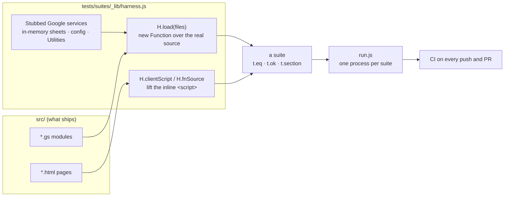

# Testing

Apps Script has no test runner, and the services it depends on
(SpreadsheetApp, UrlFetchApp, HtmlService) don't exist outside Google. StoreOps
tests the **real source anyway**, in Node, without a Google account and without
touching a real Sheet ([ADR-0017](../adr/0017-tests-run-the-real-source.md)).

```sh
npm test                      # every suite, each in its own process
node tests/suites/run.js lotto   # suites whose name contains "lotto"
```

## How a suite runs the real code



- **Only Google is stubbed.** A suite for `Reconcile` loads the real
  `Reconcile.gs` and `TillSessions.gs`; it stubs `SpreadsheetApp`, and stubs a
  collaborator like `Clover` only when the test is about what happens when it
  fails.
- **UI code is tested as shipped.** The inline script is lifted out of
  `Index.html` and run in a `vm` sandbox with a minimal DOM.
- **Performance is counted, not timed.** `perf` and `import-perf` count sheet
  reads and writes, so they mean the same on any machine.

## The house rule

**Every assertion is seen failing** against the code it guards before it is
kept: the commit before a fix, or a deliberate mutation of the fixed code. The
commit message records it. Twice, a test turned out to be passing for the
wrong reason because its stub already returned the right answer; the rule is
what catches that.

## Layers

| Layer | What it proves | Examples |
|---|---|---|
| **Module** | a module's rules over in-memory sheets | `cash-handling`, `lotto-payout`, `commission-fixed`, `sales-insights` |
| **Seam** | data survives the hop between layers | `wiring` (close sheet → RPC → sales row), `parity` (app vs public page), `reconcile` (sheet → `getRecent` → public report) |
| **Guard** | who may call what | `rpc-guards`, `routing`, `public-report`, `public-inline` |
| **Client** | the shipped UI renders the right thing | `ui-close-sheet`, `ui-dashboard`, `ui-picker`, `ui-products`, `ui-recon`, `public-render` |
| **Contract** | invariants Google enforces at runtime, checked statically | `template-guard`, `syntax`, `notifier` |
| **Docs** | the docs match the code | `docs-guard` |
| **End to end** | the whole app runs, with fictional data | `npm run docs:screenshots`, run before every docs update |

The full list, with what each suite holds down, is in
[tests/suites/README.md](../../tests/suites/README.md).

## Writing a suite

See [tests/suites/README.md](../../tests/suites/README.md#writing-one). In
short: one file, `H.suite(title)`, `t.section(...)` per behaviour, assertions
named as sentences ("a fee doesn't pay twice for the same week"), `t.done()`.
Add it to the suites README table, or the docs guard fails.

## What isn't covered

See [known gaps](docs-process.md#known-gaps).
