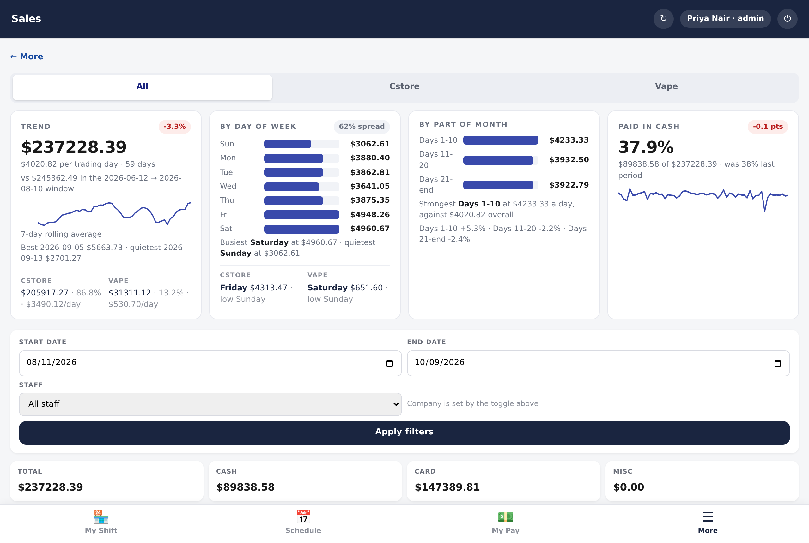
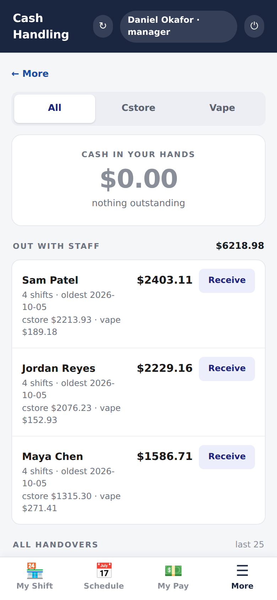
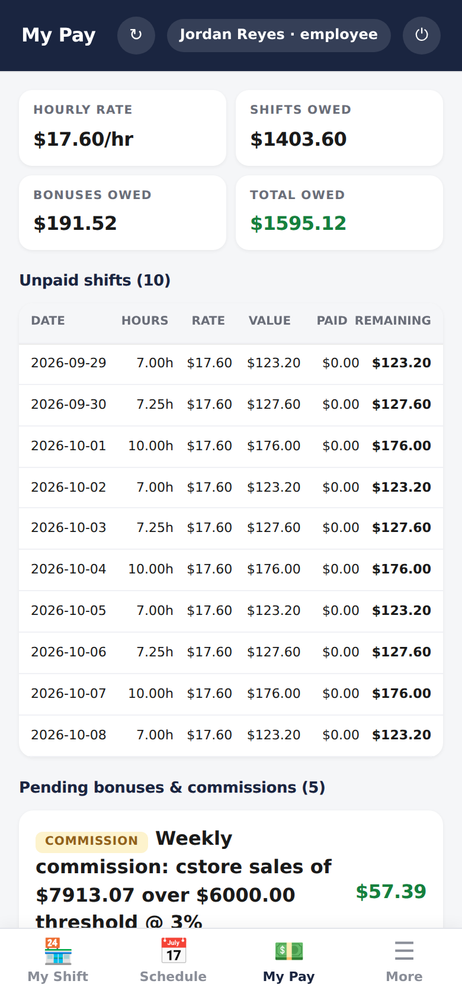

# StoreOps: a ten-minute tour

A guide to presenting this project in an interview or a management review.
Each stop has a picture, the point it makes, and where to go deeper if asked.

## In one paragraph

StoreOps replaced two earlier tools (a till reconciliation app and a payroll
project) with one app for a two-till convenience and vape store, on staff
phones: open a till, close it in one sheet, reconcile cash and cards against
what measured them, follow every dollar from the drawer to the cash manager,
schedule, pay, compute commissions, and order stock. It runs on **Google Apps
Script with a Google Sheet as the database**, so it costs nothing to host and
the owner can still open the data. It has **1,000+ automated assertions** over
the real source, and every one was seen failing before it was kept.

| Scale | |
|---|---|
| Server | 23 modules, ~11k lines, 61 RPC endpoints |
| Client | one 6k-line single-page app + two public pages |
| Data | 27 tabs, every change audited |
| Quality | 27 test suites, 1,000+ assertions, CI on every push |
| Docs | 12 component pages, 18 ADRs, generated schema and screenshots |

## The tour

### 1. A cashier's close: the core loop (2 min)

A $900 lottery win was paid out of the lotto pot and the drawer. Cash sales
are **−$180**, the pot went from $500 to $300, and the drawer still balances:
$250 float − $180 + $200 from the pot = **$270**, which is what was counted.

**The point:** the hard case is designed for, not patched around. The pot's
contribution is *derived from two counts*, not typed, so it checks itself.
→ [ADR-0006](adr/0006-lotto-payouts-are-netted-into-cash-sales.md),
[ADR-0008](adr/0008-lotto-reserve-is-derived-from-two-counts.md),
[shifts and the close](components/shifts-and-close.md)

### 2. Reconcile: say what was checked (2 min)

The vape till is on Clover, so its cards are checked against Clover's own
total. The cstore till moved to an ePOS with no Clover, so its cards say **not
verified**. They don't show "$0.00 measured" with a red loss the size of the
day's card takings.

**The point:** *blank is not zero.* "Not checked" and "checked and matched"
must never look the same. This rule was found missing on the read path while
these screenshots were being generated, then fixed and tested through the real
sheet. → [ADR-0004](adr/0004-blank-is-not-zero.md),
[reconcile](components/reconcile.md)

### 3. Owners without a login (1 min)

`?v=sales` and `?v=recon` need no PIN. The server inlines the data into the
page, so **no API is reachable without a session**. The sales page carries
aggregates only, and a test asserts it.

**The point:** the attack surface is two documents. An XSS path through a
cashier's note was found and closed during this documentation work.
→ [ADR-0003](adr/0003-public-pages-inline-their-data.md),
[security](architecture/security.md)

### 4. Insight that doesn't mislead (1 min)

Four insights, each guarded against a misleading number: averages per
*trading* day, short ranges suppressed rather than drawn, and percentage
**points** for shares. → [sales dashboard](components/sales-dashboard.md)

### 5. Money that follows people (1 min)

| | |
|---|---|
|  |  |

Takings are tracked from the drawer to the cash manager, shift by shift,
oldest first. Pay is shown to each person as *hours × rate* per day, so they
can check it themselves. Commissions are **proposed** by a weekly engine and
paid only after a person approves them.
→ [cash handling](components/cash-handling.md), [payroll](components/payroll.md),
[commissions](components/commissions.md)

### 6. Architecture in one picture (1 min)

See the [system context and layers](architecture/overview.md). Browser →
`google.script.run` → `rpc*` (session check → role check) → domain module →
Sheet. Clover and WhatsApp sit at the edges; their failures are reported and
never block a close.

### 7. How it's kept honest (2 min)

- **Tests run the real code.** Suites load `src/*.gs` and the UI's own inline
  script in Node, with only Google's services stubbed
  ([ADR-0017](adr/0017-tests-run-the-real-source.md)).
- **Every assertion is seen failing** before it's kept. This has caught
  tests that passed for the wrong reason.
- **Performance is counted, not timed.** The product import went from 667
  sheet reads for 222 rows to a fixed number of reads however large the paste
  ([ADR-0010](adr/0010-bulk-import-reads-once-writes-once.md)).
- **Docs are generated where possible and guarded in CI.** Screenshots come
  from the running app over fictional data, and the schema reference is built
  from `Setup.gs`. A failing docs guard blocks drift
  ([ADR-0018](adr/0018-docs-are-generated-from-the-running-code.md)).

## Questions you may be asked

| Question | Short answer | Deeper |
|---|---|---|
| Why a spreadsheet as a database? | Free, nothing to run, and the owner can open it. The costs (no transactions, slow calls) are handled in code. | [ADR-0001](adr/0001-apps-script-and-sheets-as-the-platform.md) |
| How is auth done without Google accounts? | PIN + lockout, opaque token, server-side session, role checked on every RPC. | [ADR-0002](adr/0002-pin-login-with-server-side-sessions.md) |
| What happens when hardware changes? | Config per till; columns are added, never repurposed; totals stay continuous with no date logic. | [ADR-0005](adr/0005-card-shapes-are-mutually-exclusive-columns.md) |
| What's the worst bug you found? | A WhatsApp message silently not sent for days: the parameter count followed the till's state, not the template. Now the template decides the count, and a failed send says why. | [ADR-0007](adr/0007-message-shape-follows-the-template.md) |
| What would you do next? | Script locks around payment allocation, a payroll suite, archiving the audit log. | [known gaps](guides/docs-process.md#known-gaps) |
